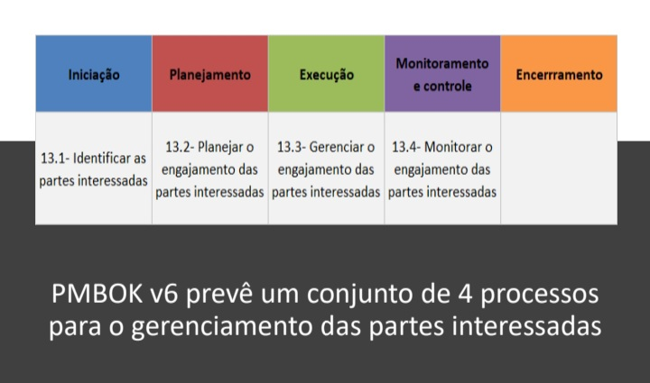
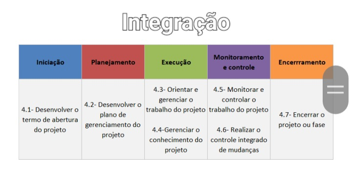
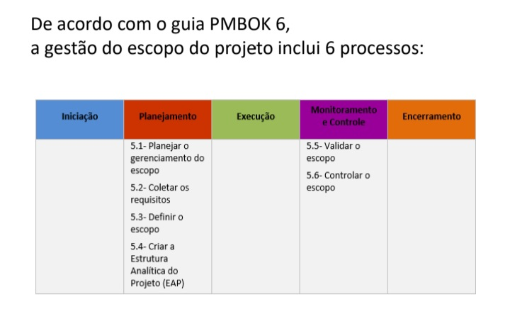
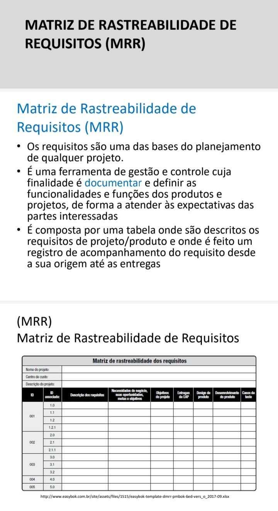
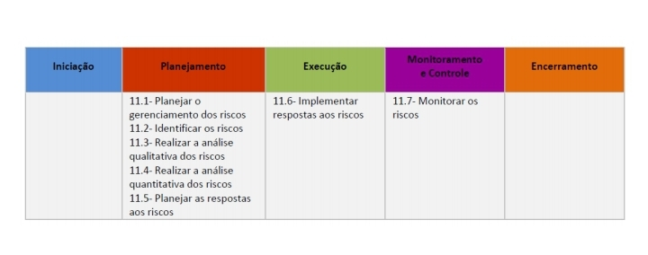
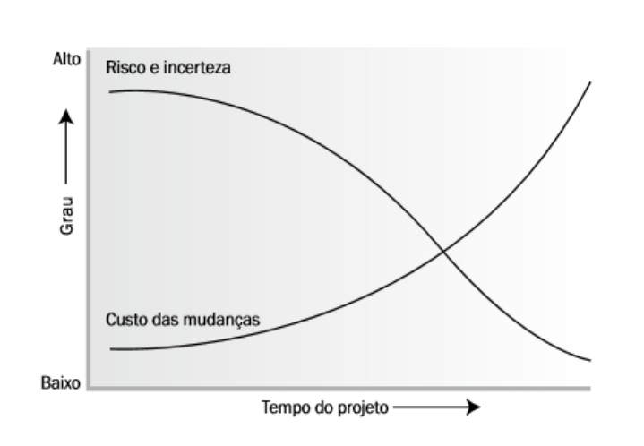
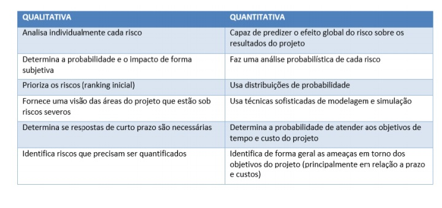
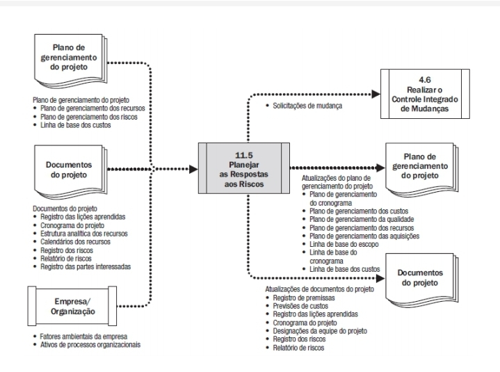
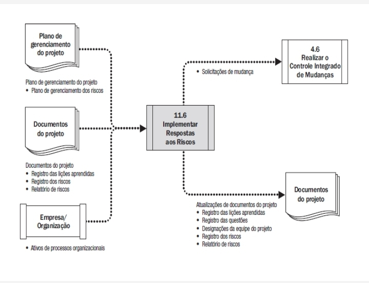
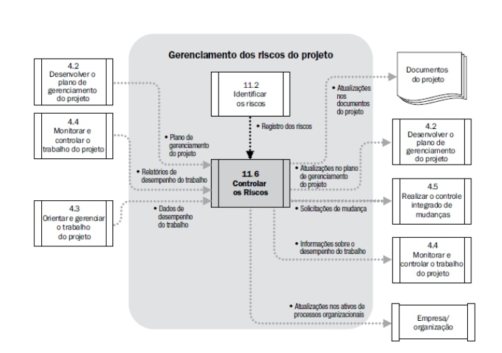

# Gestão de projetos de TI
2024-10-24
tags: [Business](../Business.md)

* lembra de definir normas para redefinir o tempo do projeto
* lembra de definir normas para problemas hambientais

Política: 

(Custo + lucro + risco + imposto) + gordurinha

Mudanças em escopo, tempo e custo, devem ser previstas e definidas como negociáveis

Quando você meche no escopo, o tempo é o custo aumentam, é um triângulo que se espicha

Problemas comuns já foram estudados e já tem soluções prontas

* lembrar de deixar definido o que é manutenção e o que é projeto.

Estrutura Analítica do Projeto (EAP)

> **É “o processo de subdivisão das entregas e do trabalho do projeto em componentes menores e mais facilmente gerenciáveis**

Desmembra em partes o projeto para gerenciar ele melhor.

Na EAP, nós temos as entregas, suas fases e pacotes de trabalho que estão descritas mais detalhadamente no dicionário da EAP, podendo conter critérios de aceitação para cada pacote, recursos necessários, estimativas, ferramentas, orientações e uma descrição mais detalhada de cada um deles.

E é importante validar isso com o cliente.

## Concepção

ETP

## Abertura do projeto

TAP

## Integração

### **PROCESSO DE DESENVOLVIMENTO DO PLANO DE GERENCIAMENTO DO PROJETO**

Antes de pôr mãos à obra e começar o projeto propriamente dito, é preciso:

1. Reservar um tempo para planejá-lo adequadamente

2. Elaborar um esquema ou uma estratégia que demonstre como as tarefas do projeto deverão ser executadas dentro de um orçamento, custo e prazo determinados

O processo de desenvolvimento do plano de gerenciamento do projeto determina o que precisa ser feito, quem irá fazê-lo, quanto tempo vai levar e quanto irá custar

O resultado desta etapa é um plano-base que é um documento central que descreve como o projeto será executado, monitorado, controlado e encerrado.

### **PROCESSO DE ORIENTAÇÃO E GERENCIAMENTO DO TRABALHO DO PROJETO**

Processo realizado ao longo de todo o projeto que lidera e realiza o trabalho definido no plano de gerenciamento do projeto e que implementa as mudanças aprovadas para atingir os objetivos do projeto

• Seu objetivo é fazer o gerenciamento geral do trabalho do projeto e das entregas, aumentando a probabilidade de êxito do projeto

### **PROCESSO DE GERENCIAMENTO DO CONHECIMENTO DO PROJETO**

Realizado ao longo de todo o projeto, faz uso de conhecimentos organizacionais aplicados em projetos anteriores, podendo inclusive criar novos conhecimentos, para produzir ou aprimorar os resultados de um projeto

• De uma perspectiva organizacional, o gerenciamento do conhecimento envolve garantir que as habilidades, experiências e expertises da equipe do projeto e de outras partes interessadas sejam utilizados antes, durante e depois do projeto

• Todo conhecimento é gerenciado de modo que possa ser reaproveitado e que possa apoiar novos projetos ou fases futuras

### **PROCESSO DE MONITORAMENTO E CONTROLE DO TRABALHO DO PROJETO**

Realizado durante todo o projeto, faz o acompanhamento, a análise e o relato do progresso geral em contraste com os objetivos de desempenho definidos no plano de gerenciamento do projeto

Tem como objetivo permitir que as partes interessadas entendam a situação atual do projeto, reconheçam as ações adotadas para abordar quaisquer problemas de desempenho e tenham visibilidade sobre a situação futura do projeto, com previsões de custos e prazos

### **PROCESSO DE REALIZAÇÃO DO CONTROLE INTEGRADO DE MUDANÇAS**

Faz a revisão de todas as solicitações de mudança, a sua aprovação (ou não) e a comunicação das decisões tomadas a respeito, durante todo o projeto

• Faz o gerenciamento das mudanças aprovadas nas entregas, nos documentos do projeto e no plano de gerenciamento do projeto. 

• Revisa todas as solicitações de mudança nos documentos do projeto, nas entregas ou no plano de gerenciamento e determina a resolução das solicitações de mudança

* Seu principal objetivo é permitir que as mudanças documentadas no projeto sejam consideradas de forma integrada, abordando o risco geral do projeto, que frequentemente resulta de realizar mudanças sem considerar os objetivos ou planos gerais do projeto

## Escopo

**MATRIZ DE RASTREABILIDADE**

## Gerenciamento de riscos

 É um evento ou condição incerta, mas não imprevisível, resultante de uma ou mais causas, com uma probabilidade de ocorrer no futuro que, se por acaso venha acontecer, irá impactar de forma positiva(oportunidade) ou negativa (ameaça) o projeto, afetando de algum modo o seu resultado final

Os riscos e as incertezas são maiores no início do projeto e que diminuem à medida que o projeto avança onde decisões passam a ser tomadas e as entregas vão sendo aceitas

O objetivo desse processo é definir como os riscos serão abordados, qual metodologia será utilizada, quais são as pessoas envolvidas e as suas funções/responsabilidades, as categorias de risco, a definição da escala de probabilidades e impacto dos riscos, a matriz de probabilidade e impacto, os formatos de relatórios etc.

Matriz gerenciamento de risco = uma planilha excel com os riscos do projeto, probabilidade de acontecer, requisito, qual o grau de periculosidade, custo de correção e custo de deixar rolar o risco. 

### IDENTIFICANDO OS RISCOS DO PROJETO

Deve ser feito de forma iterativa e pode se valer de várias formas de informação, como por exemplo: informações históricas, brainstorming, entrevistas etc

Também, é possível se valer de premissas, dados históricos, conversas com especialistas e qualquer outra informação confiável que seja útil. 

É importante que todos os riscos (relevantes) sejam catalogados nesse mapeamento inicial p.ex.: probabilidade de chuva X projeto engenharia civil/desenvolvimento de software

Para cada risco identificado, deve-se relacionar uma consequência em potencial, tais como, p.ex.: atrasos no cronograma, despesas adicionais, não cumprimento de requisitos, insatisfação do cliente etc.

### Avaliando os riscos

Uma vez que os riscos estejam identificados, é hora de determinar quais deles são mais importantes para o projeto e devem ser priorizados.

Isso usualmente é feito em duas etapas, sendo que a primeira delas é análise qualitativa dos riscos, enquanto a segunda é a quantitativa

* **Análise qualitativa**: Consiste em determinar o impacto e a probabilidade de um risco e com base nisso saber qual é o seu valor para um projeto com base em estatísticas históricas, dados, conversas específicas, etc...No método mais comum de análise, a determinação da probabilidade de que o evento de risco ocorra, feita pelos membros da equipe juntamente com o gestor, é estabelecida como um valor de porcentagem, o grau do impacto que este teria sobre o objetivo do projeto pode-se atribuir, p.ex., uma classificação de "Alto", "Médio" ou "Baixo" e o dano ou ganho financeiro desse risco escrito em uma moeda como o real (ou outra qualquer)

* **Análise quantitativa**: Analisa numericamente e com simulações o efeito combinado dos riscos individuais identificados e outras fontes de incerteza nos objetivos gerais do projeto. Justamente por envolver dados é mais custoso.

### PLANEJAMENTO DE RESPOSTA AOS RISCOS

Tem como objetivo desenvolver opções e um plano de ação que possa aumentar as oportunidades e reduzir o impacto ou a probabilidade das ameaças aos objetivos do projeto

Como lidar com os riscos: 
* Evitar o risco
* Diminuir o risco
* Transferir o risco para terceiros
* Aceitar o risco

### IMPLEMENTANDO RESPOSTAS AOS RISCOS

Processo de implementar planos acordados de resposta aos riscos. O principal benefício deste processo é a garantia de que as respostas acordadas aos riscos sejam executadas conforme planejado a fim de abordar a exposição ao risco geral do projeto, minimizar ameaças individuais e maximizar as oportunidades individuais do projeto

### MONITORANDO OS RISCOS

Envolve a revisão regular da matriz de avaliação de riscos durante o projeto. Avalia todos os riscos para determinar se há alguma probabilidade de ocorrência ou de impacto em potencial de qualquer dos riscos

Determinar mudanças em um risco em particular se aumentou em prioridade de atenção ou se o risco diminuiu em importância

Novos riscos não considerados podem surgir e serem identificados como prejudiciais para o projeto e depois devem ser adicionados à matriz de avaliação 

## Gerenciamento de projetos

Quanto menor a complexidade, mais fáceis de gerir. Quanto maior a complexidade, maior vai ser o grupo de acompanhamento de projetos. Isso é importante para manter o controle do projeto e é claro que, para isso, precisamos antecipar às possíveis dificuldades. 

Por isso, é importante ter um acompanhamento e quando mais pertinente for a informação, mais frequente você vai ter que fazer reuniões e ter informações.

Monitoramos para: 

* Avaliar saúde
* identificar problemas
* identificar áreas que precisam de atenção especial
* recomendar ações
* planos de recuperação quando for necessário

Acompanhamos: 
* Áreas de risco
* Progresso
* Atividades
* Fururo do projeto

Rotina de acompanhamentos: uma checklist de coisas que precisam ser feitas 

KPIs: métricas principais ( Key performance Indicator). Com eles, é importante determinar as métricas de custo e características da KPI.

### Coleta e análise de dados periódicos

BI - pega na base de dados
BAM - com dados não estruturados

### Encerramento de projetos

Projetos acabam, segundo [[Kim Heldman]], por esses motivos: 

* **Absorção** - Evoluem para operações contínuas, quando um projeto vira processo
* **Esgotamento** - Quando acabam os recursos
* **integração** - Quando os recursos são re-alocados ou devolvidos.
* **extinção** : quando realmente não existe mais nada para fazer, concluído, aceito e encerrado.

## TAP

O TAP, na área de gerenciamento de projetos, geralmente se refere ao **Termo de Abertura do Projeto**. Esse documento é fundamental porque:

- **Formaliza o Início do Projeto:** Ele autoriza oficialmente o projeto, permitindo que a equipe comece a planejar e executar as atividades.
- **Define os Objetivos e Escopo:** O TAP descreve, de maneira sucinta, os objetivos do projeto, seu escopo, entregáveis principais e os resultados esperados.
- **Identifica os Principais Stakeholders:** Nele são listadas as partes interessadas e os papéis de cada um, facilitando o alinhamento e a comunicação durante o desenvolvimento do projeto.
- **Estabelece Restrições e Premissas:** O documento também aponta as restrições (como prazos, custos e recursos) e as premissas que foram consideradas na sua elaboração.
- **Base para o Planejamento:** Com o TAP definido, a equipe tem um ponto de referência para desenvolver planos mais detalhados, como a EAP (Estrutura Analítica do Projeto), cronogramas e orçamentos.

Em resumo, o TAP é um documento estratégico que serve como “carta de lançamento” do projeto, assegurando que todos os envolvidos tenham uma visão comum dos objetivos, limites e expectativas antes de iniciar as etapas de planejamento e execução.

## EAP 

A EAP, ou Estrutura Analítica do Projeto, é uma ferramenta de gerenciamento de projetos que consiste na decomposição hierárquica do escopo total de um projeto em partes menores e mais gerenciáveis. Em outras palavras, ela organiza e define todo o trabalho a ser realizado, dividindo-o em entregáveis e atividades que, quando completados, resultam no produto ou serviço final do projeto.

Principais características da EAP:

Hierárquica: O projeto é dividido em níveis, começando pelo objetivo final e se desdobrando em componentes cada vez menores.
Foco no Escopo: A EAP ajuda a visualizar todas as entregas do projeto, garantindo que nenhum aspecto importante seja negligenciado.
Facilita o Planejamento e Controle: Ao dividir o trabalho em partes menores, torna-se mais fácil estimar custos, prazos e recursos, bem como monitorar e controlar o andamento do projeto.
Em resumo, a EAP é fundamental para estruturar e organizar as atividades de um projeto, contribuindo para uma gestão mais clara, eficiente e orientada aos resultados.