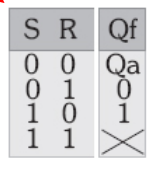
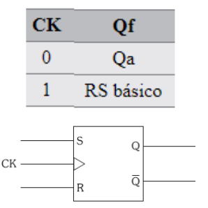
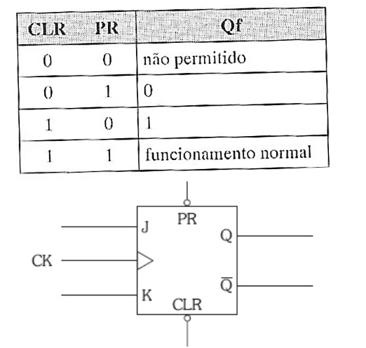
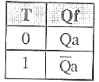
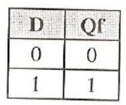
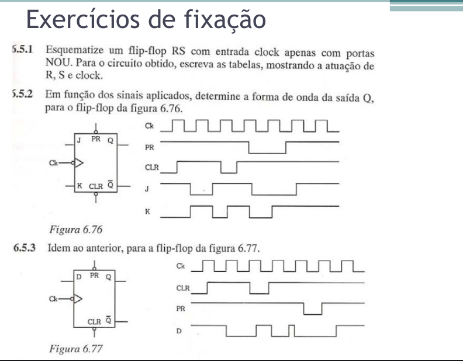

# Eletrônica digital básica
2023-08-25
tags: [-Hardware](-Hardware.md) [[Lógica]]

Circuito combinacional = depende das entradas

## De imagens até expressões

## De expressões para imagens

## Diagrama de Karloh 

## Flip Flops

Circuitos Sequenciais = dependem das entradas e de saídas que dependem também da última saída do Flip Flop

Clock = sequência de pulsos, onda

Um Flip Flop tem no máximo duas entradas, onde tem duas saídas, uma saída normal e uma saída barrada.

**Inconsistência** = quando não tem a saída barrada.

### RS básico

RS = re set

Existem elos de realimentação:

![[../../img/20231006_183351.jpg]]

Estado estável é quando temos um Q = Qa
Instável = quando é diferente do último Q

Os últimos valores desse Flip Flop vão ser Q = Q barrado. O que não pode acontecer, pois o Flip Flop é para ser um loop.

**Qa** = Q atual

![[../../img/20231006_185941.jpg]]

Essa seria a tabela verdade do Flip Flop 

Pensa em uma lâmpada, quando estamos setando o circuito, vamos forçar ele a ficar ligado e quando o reset é ligado, vamos voltar ao estado inicial de loop

No RS básico, a tabela verdade perde o último caso, Qa vai sempre ser a última variável da tabela verdade...

#### RS com Clock

![[../../img/20231006_190527.jpg]]

Quando o Clock é 1, temos uma porta inversora, o que transforma o Clock no RS, RS BÁSICO 
Quando temos o Clock 0, mantém 1 no circuito, o que transforma num loop

### JK

Não tem o problema do básico, que não perderemos os dois últimos casos

![[../../img/20231006_191645.jpg]]

#### Com clear e preset

![[../../img/20231006_192725.jpg]]

Temos aí um botão de liga e desliga no Flip Flop

![[../../img/20231006_193149.jpg]]

**A bolinha é bem importante, pois quer dizer que ele é ativado com 1**.

#### JK mestre escravo

Antes, se o circuito tivesse alterando o J e o K, ele continuaria mudando no meio do Clock. Com o mestre escravo, um sempre vai ser uma porta inversora que não vai mudar o valor na troca do clock 

![[../../img/20231006_194112.jpg]]

É basicamente o J e o K que não muda durante a descida do clock

![[../../img/20231006_194927.jpg]]

Bolinha é sensível a decida

### O Flip-Flop T 

São flip-flops de toogle, padrão. 

### Flip Flop D

Esses são os flip flops de memória, eles sempre são os mesmos valores até mudar.

### Resumo

## Exercícios

### Flip Flops

[EFFlipFlops](img/EFFlipFlops.md)
