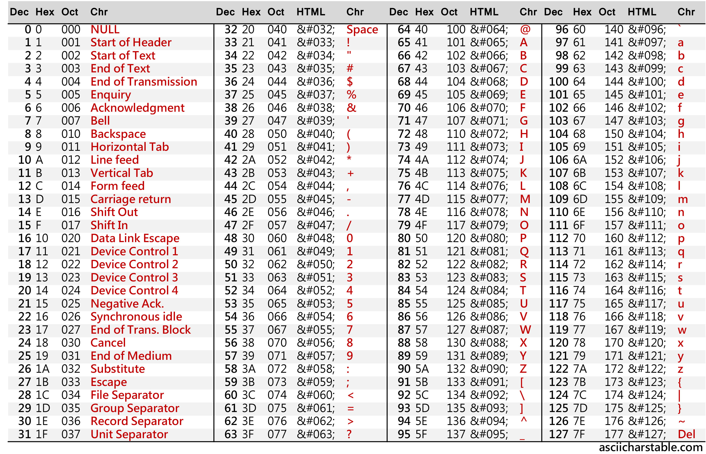

# Eletrônica digital básica
2023-08-25
tags: [-Hardware](-Hardware.md) [[Lógica]]

Circuito combinacional = depende das entradas

## De imagens até expressões

## De expressões para imagens

## Diagrama de Karloh 

## Flip Flops

Circuitos Sequenciais = dependem das entradas e de saídas que dependem também da última saída do Flip Flop

Clock = sequência de pulsos, onda

Um Flip Flop tem no máximo duas entradas, onde tem duas saídas, uma saída normal e uma saída barrada.

Inconsistência = quando não tem a saída barrada.

### RS básico

RS = re set

Existem elos de realimentação

![[../../img/20231006_183351.jpg]]

Estado estável é quando temos um Q = Qa
Instável = quando é diferente do último Q

Os últimos valores desse Flip Flop vão ser Q = Q barrado. O que não pode acontecer, pois o Flip Flop é para ser um loop.

![[../../img/20231006_185941.jpg]]

Essa seria a tabela verdade do Flip Flop 

Pensa em uma lâmpada, quando estamos setando o circuito, vamos forçar ele a ficar ligado e quando o reset é ligado, vamos voltar ao estado inicial de loop

#### RS com Clock

![[../../img/20231006_190527.jpg]]

Quando o Clock é 1, temos uma porta inversora, o que transforma o Clock no RS, R . S BÁSICO 
Quando temos o Clock 0, mantém 1 no circuito, o que transforma num loop

### JK

Não tem o problema do básico, que não perderemos os dois últimos casos

![[../../img/20231006_191645.jpg]]

#### Com clear e preset

![[../../img/20231006_192725.jpg]]

Temos aí um botão de liga e desliga no Flip Flop

![[../../img/20231006_193149.jpg]]

A bolinha é bem importante, pois quer dizer que ele é ativado com 1 

#### JK mestre escravo

Antes, se o circuito tivesse alterando o J e o K, ele continuaria mudando no meio do Clock. Com o mestre escravo, um sempre vai ser uma porta inversora que não vai mudar o valor na troca do clock 

![[../../img/20231006_194112.jpg]]

É basicamente o J e o K que não muda durante a descida do clock

![[../../img/20231006_194927.jpg]]

Bolinha é sensível a decida

## Substituição de dados na Cache

![[20231027_202828.jpg]]

* Política de salvamento: 

Cache é pequena, então vamos trazer por blocos

Mapeamento direto: não tem blocos, vai direto no dado, mas as células vão ficar se trocando em uma única linha 0 vai no bloco 1 e o 1 no 2, mas o 3 vai de volta na 

Associativo:
Vai mudar toda hora sem essa organização de cada célula em cada linha

Associativo por conjunto: 
Vai ter um tipo de algoritimo, vai ter uma política de mudança
![[20231027_191917.jpg]]

Tempo sem ser utilizado
Quantas vezes sem ser utilizado

* Política de escrita:

Temos o problema de quando trocamos as células para executar alguma coisa mas não temos mais essa célula (dado)

![[20231027_192835.jpg]]
![[20231027_193219.jpg]]

E como vamos criar fisicamente a organização da memória: 

![[20231027_193651.jpg]]

Tipos de seleção:

* Linear
![[20231027_193803.jpg]]

* Matriz
![[20231027_195516.jpg]]

Então vamos a uma breve comparação:

![[20231027_195254 1 1.jpg]]

Quando organizamos em matriz, temos uma performance maior.

## Executando instruções

Isso é uma instrução de máquina:

![[20231027_203845.jpg]]

Ciclo de vida das instruções:

![[20231027_204808.jpg]]

Analisa aí uma CPU, tem que escrever o que cada uma faz

O lado direito é para puxar e armazenar na memória

Tem a ACC que vai servir como se fosse um cache para fazer as operações e guarda também os resultados

Tem o CI que vai ser como se fosse uma thread de chamadas

REM = endereço para salvar a memória

RdM = instrução

Ri = instruções
Ci = Endereço de instruções

Tem dois tipos de operação: 

**Operações de processamentos** de dados, que vai rolar na UAL
* multiplicação e divisão pode ser feito através de deslocamentos do número binário adicionando 0 ou 1

**Operação de operações**: Que vai ser como se fosse uma call stack

Alguns processadores guardam o estado da operação

### A Fundo sobre os componentes

#### Falando sobre a UC

![[20231027_211938.jpg]]

![[20231027_212055.jpg]]

![[20231027_212244.jpg]]
![[20231027_212507.jpg]]

Veja um exemplo de transformação de clock com uma frequência maior

![[20231027_213115.jpg]]

Mas isso não significa que seja melhor, tem que ver a benchmark (A velocidade de processamento) pq tem outras coisas que influenciam a velocidade

Vale lembrar que antes do "Soma ao ACC a instrução", temos que passar para o RI a instrução, para ela ser decodificada e na realidade, somamos 1 ao ACC, não somamos o valor da instrução:

###### Projetando UCs

#### Falando sobre o clock

![[20231027_213411.jpg]]

#### Falando sobre o decodificador

![[20231027_213748.jpg]]

#### Falando sobre a UAL

Entendendo mais profundamente o que aconteceu nessa brincadeira, perceberemos que fudeu para dividir e multiplicar por números impares. Para isso, ouve uma época que as pessoas literalmente faziam um processador separado chamado de **Coprocessador de ponto flutuante**, e com a evolução, isso só foi colocado dentro do mesmo processador

Tenha em vista que: 1. x e y são valores que serão somados 2. z = resultado da operação m = 0 C = o bit "vai 1", o carry. 

#### Exercícios

## Pipelining

Nada mais é que a busca e a execução das células na memória

A soma de T_1 e T_2 nada mais é que o tempo total do processo, e não sei se perceberam, mas quando estamos tratando de processos, estamos aqui adentrando na parte administrativa de sistemas e estamos aqui adentrando em engenharia de software. O que eles perceberam na época é que esses processos pareciam com a linha de montagem de automóveis.
Com isso, [[Henry Ford]], no século XX, criou a metodologia de montagem pipeline que visa fazer de forma independente esses processos, o que a gente conhece hoje como uma metodologia assíncrona. Dessa forma, o ciclo de busca e o de execução se tornaram independentes e mais rápidos

Exemplo:

Mas aí temos problemas:

Com esses problemas, a galera resolveu adicionar mais Ts:

Exemplo desse pipeline com 6 estágios:

Contudo, ainda temos um problema:

###  Barramentos

É o que interliga os componentes e dá a capacidade de transmitir informações, fios.

Protocolos:

## Representação de dados

Tem diversas formas de representar dados para o hardware compreender, cada dado é representado por um número de bits e a quantidade de bits utilizada afeta inúmeros componentes do hardware. Pois, quando temos uma representação de 16bits, todos os componentes devem suportar 16bits para ter um melhor funcionamento, da UAL até o barramento. Como dito antes, o programador deve dizer como esse dado será manipulado. Cada type de variável, cada interface existente deve ter, por definição, uma representação em bits, pois como você vai realizar as operações vai mudar dependendo do type:

### Character

Cada character vai ser decodificado por uma sequencia de bits

ASCII 

### Number

## Representação de instruções

Exemplo de instrução:

Representação em assembly de operações:

### Modos de endereçamento

Como sabemos qual é o tipo?

Especificidades:

Exemplo do JMP

Exemplo MOV

Exemplo CP

Exemplo do LDA

Exemplo de loop em Assembly com endereçamento direto e por registrador:

## Arquiteturas RISK e CISC

### Arquitetura CISC
Complex Instruction set computer

Antes de entendermos a arquitetura risk que é utilizada hoje em dia, entenderemos que os processadores complexos eram utilizados para facilitar a vida dos programadores, contudo, os compiladores se tornaram muito complexos. E isso é a arquitetura CISC, são arquiteturas de processadores que tem uma grande quantidade de instruções, que incluem mais métodos de endereçamento e utilizam muito microprogramação.

### Arquitetura RISC
Reduce Instruction Set Computer

Na década de 70, a [[IBM]] desenvolveu o primeiro computador RISK mas não teve sucesso comercial a priore, contudo, criaram os processadores RS/6000 e, mais a frete, em colaboração com a [[Motorola]] e a [[Apple]], criaram a família POWER PC, que foi um grande sucesso no mercado.

Em 1982, a era da linguagem C e Pascal se mantinha e descobriu-se que utilizavam-se mais 5 operações e as outras eram muito pouco usadas pelos programas, além dessas serem as que mais se demandava capacidade computacional. Dessa forma, eles precisavam revolucionar a forma de programar, então, o hardware precisava evoluir para atender a grande demanda dessas operações.

Dessa forma, foi criada a arquitetura RISK, processadores com apenas algumas instruções.

Dessa forma, na arquiteturas risk, só tem LOAD e STORE e uma grande eficiência das pipelines.

### Medidas de desempenho

