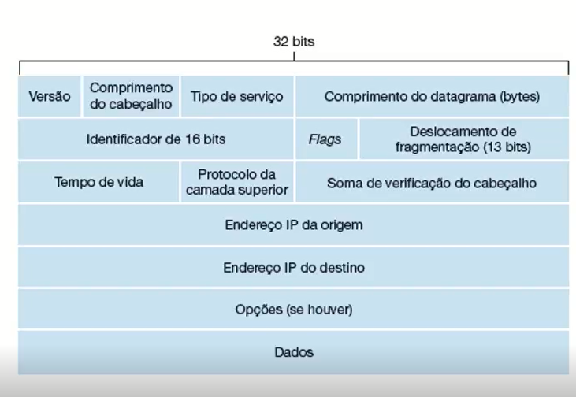
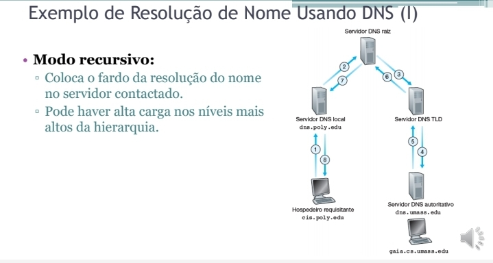
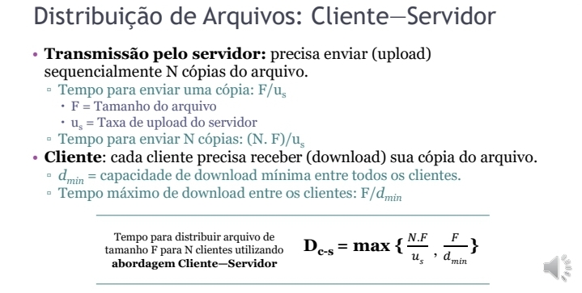

# Redes de computadores
2024-02-28
tags: [-Hardware](-Hardware.md)

**Redes de computadores** = Qualquer dispositivo conectado com outro dispositivo, seja por sinal, seja por wifi, cobre, rádio, satélite (Os **enlaces**)  que troca **pacotes** de dados entre esses dispositivos por meio de um **comutador de pacotes** (Hoteadores). Veja a Imagem:

## Desenvolvimento

### Introdução aos conceitos

Sobre o switch da rede, veja a descrição do chat gpt:

 <i> A função principal de um switch é conectar dispositivos dentro de uma rede local (LAN) e aprender os endereços MAC (Media Access Control) desses dispositivos. Cada dispositivo conectado a um switch possui um endereço MAC exclusivo, que é usado para identificá-lo na rede. O switch usa essa informação para tomar decisões de encaminhamento eficientes. ~ChatGPT</i>

Então, acredito que seja algo como um distribuidor local, como um roteador seletivo.

Já as **redes de redes** ou ISPs de acesso, são as empresas que fornecem redes, como OI, TIM, Claro, VIVO... E obviamente, todos devem seguir um protocolo, protocolos esses criados pela IETF (Internet Engineering Task Force). Desse modo, as aplicações consomem as redes como se fossem APIs, vejamos um pouco mais sobre esse e muitos assuntos:

------------------------

$$T_{s}=\frac{L_{bits}}{R_{bits/s}}$$

$$t_{s} = \frac{d_{m}}{v_{m/s}}$$

------------

#### ISPs

Dessa forma, Para que a conexão aconteça com outros paises, precisamos que as redes sejam conectadas de alguma forma, redes essas que caso conectassem umas com as outras, tornaria o processo de criação e de arquitetura dessas redes, simplesmente inviável, a dificuldade de escala de novas redes seria horrível, além de piorar a qualidade do sinal.

Desse modo, deveria criar um ISP Global, para que exista uma hierarquia dessas ISPs.

Contudo, não existem regras no mercado, empresas viram oportunidades e criaram pais ISPs Globais:

E na medida que existem novas ISPs globais, temos a necessidade de trocar dados entre elas, desse modo, criaram-se os **IXPs**. Além disso temos os acessos que não são feitos pelos ISPs globais e sim de um ISP global para uma ISP que não seja do domínio da própria ISP Global, os **peering links**

Dessa forma, algumas ISPs tomaram os cargos de ISPs regionais, _regional nets_, e tomaram a iniciativa de fazer essas conexões com os globais, de forma que fique mais simples para as ISPs:

E aí vai ficar mais ou menos assim:

#### Protocolos

São padrões de comunicação entre os IXPs, Computadores, ISPs, a língua das redes.

#### Enlaces

Os meios, os links, podem ser conhecidos também como **redes de acesso**.

Aí podemos perceber uma pequena diferença entre os enlaces:

**Enlaces ponta a ponta** - Exemplo, um cabo de internet no roteador
**Enlaces compartilhados** - Temos apenas um meio de propagação para vários dispositivos, um wifi

E isso torna eles bem diferentes.

Até pela forma que propagamos eles, com o cabo, usamos energia para definir o que seria o bit 0 e o que seria o bit 1. Exemplo: 5w = 0 e 15 w = 1.
Já no wifi, pelo meio fisico aberto, usamos ondas eletromagnéticas de 100hz para bit 0 e 150hz para bit 1.

Dessa forma, os dispositivos devem ter uma placa de rede que suporta a conversão desses meios tanto para a ida quanto para a volta.

##### Taxas de Transmissão

Onde L = pacote e R = capacidade do enlace.

$$T_{s}=\frac{L_{bits}}{R_{bits/s}}$$

Vale lembrar que ainda precisaremos diminuir as interferências.

Dessa forma precisaremos do comprimento do canal e a velocidade de propagação para calcular o tempo de propagação de 1bit pelo meio.

$$t_{s} = \frac{d_{m}}{v_{m/s}}$$

Atraso de processamento -> atraso de fila -> atraso de transmissão -> atraso de propagação

-----------------------------------------------
### Arquitetura e Filosofias de Projeto

Adentrando a arquitetura das redes, como na foto a seguir:

Podemos perceber que temos as **bordas das redes**, que são justamente os dispositivos finais, dessa forma então temos os **núcleos** que são justamente os ISPs. Além disso, entre esses dois, teremos os **roteador de borda**, que conecta a torre ou o roteador às bordas.

Já no caso das redes domésticas, o meio da figura, teremos que ter um moldem, entre o roteador e o núcleo, isso acontece pois precisamos modular o sinal para que os dispositivos possam captar eles.

Entrando mais a fundo nas redes de acesso (Enlaces), temos o **DSL**:

Que nada mais é do que usar a rede telefônica para passar os pacotes de dados. E como pode perceber, temos o DSLAM que vai fazer essa conversão.
Uma tecnologia parecida com o DSL é a **ADSL**, que nada mais é do que uma conexão DSL **assimétrica**, que vai fazer com que as taxas de download e upload sejam diferentes ainda usando a mesma rede telefônica.
Já a VTSL, é exatamente igual a ADSL, só que ela suporta mais mb/s 

Já a HFC é compartilhada, o que significa que os clientes perdem velocidade quando eles usam a internet ao mesmo tempo.

Temos também o FTTH que só passa fibra ótica para as residências, bem melhor.

Outro tipo de rede é os **satélites** que são usados quando não temos essas opções mais robustas (a priori). 

Além dessas formas de redes, temos as LANs ou WLAN (LANs por wifi) e as WANs que são as redes locais e as redes sem fio de cobertura.

Roteadores por cabo wifi.

#### Arquitetura de roteadores

Veja o resultado de quando usamos um **trace route** para tracejar a conexão:

#### Filosofias

### Comutação de pacotes, Multiplexação, Enfileiramento

O store-and-forward consiste em armazenar em algum lugar antes de mandar para algum destino

1 MB(byte) = 8 Mbits (bit). Se ligas nas conversões, precisamos deixar tudo em bit para poder dividir.

L = 4MB  = 32 Mb
R = 2 Mb/s  
V = ?
$$V = \frac{32Mb}{2Mb/s} → \frac{32}{2s} ∴ 16s$$

E esse armazenamento deve ocorrer pois deve ocorrer um processamento de para onde vai esse pacote.

E olha que doidera, não tem como armazenar infinito, então se o roteador estiver cheio, ele vai simplesmente descartar o pacote.

Na comutação de circuitos, os circuitos vão ser reservados para um canal de comunicação durante e mesmo se não tiver comunicação

Pensa no FDM como um cabo que vai definir comunicações em cada frequência, dessa forma os usuários vão poder se conectar e fazer vários processos usando frequências.

Já o TDM, temos quadros de tempo que vão ser designados para os processos, exemplo, toda vez que temos um tempo 2, carrega por x tempo o download do seu joguinho.

1 MB ~= 1000
1 KB ~= 100
∴ ~= 10 usuários podem usar 100kb/s simultaneamente

Agora falando sobre a chegada dos pacotes, não é porque um pacote saiu primeiro quie vai chegar primeiro, eles possuem uma chegada desordenada

### medidas de desempenho

**Atraso**: Atraso de propagação
**Perda de pacotes:** pacotes perdidos (fila, mal funcionamento)
**Vazão**: bits por segundo, quão rápido chega ou envia pacotes.
**Jitter**: variação de Atraso

**Fim a fim**: de ponta a ponta, considera também os tempos de atraso.
**Até o nucleo**: Por salto

> `ping <site> - ping <DNS>`

*x* = constante

> **D_modal** = *dPor* + dFila + *dTrans* + *dProp*

**d_modal** = Atraso total
**dFila** = Atraso por enfileiramento
**dTrans** = Atraso de transporte, colocar bits no enlace
**dProp** = Atraso de propagação de bits

E esse cálculo é lógico, depende das quantidades de enlaces, atrasos....

**Taxa de transmissão de fluxo** = A taxa que o app cria o fluxo de pacotes

**Enlace de gargalo** = o R que tem vazao menor.

Vazão fim-a-fim por conexão: 

$$ min( R_c, R_s, R /{10}) $$

### Camadas

Tem o formato OSI  que tem mais dias Camadas: apresentação e sessão

Camada de redes = datagrama

#### Camada de transporte

*Na camada de transporte: datagrama = pacote*

**Upd** so oferece o serviço de menor esforço  
**Tcp** já usa serviços de entrega confiável  

**Multiplexação** = coloca o cabeçalho para encaminhar a mensagem.
**Demultiplexação** = verifica de quem é o datagrama e encaminha.

#### Princípios transferência confiável de dados

O Tcp só fornece dados confiáveis por causa dos seus métodos de implementação

### Cabeçalhos

**Payload** = dados do pacote
**Over-head** = cabeçalho

### Segurança

**DDOS** e **DOS** = Um monte de bits enviando dados até cair o servidor

**Wireshark** e **sniffers** para detectar ações na rede.

### HTML e mensagens

**Conexões não persistentes**: Fica a cada objeto reiniciando a conexão.

**Conexão Persistente**: Deixa ela aberta até o término de uso.

1.1 = já tem persistente

#### Cookies

Salva dados em local storage

#### Web Caches

Podemos criar um servidor proxy nos núcleos da rede para facilitar o acesso a dados do servidor, o servidor só vai ser requisitado se os dados não tiverem no web cache, tornando as requisições mais rápidas.

Além de deixar mais rápido a resposta, diminui o tráfego do enlace

Para calcular o tempo de atraso usando o web cache, temos que saber o que realmente hitou o cach ou que ratou o cache (hit rate)

Tipo, 40% das requisições hitam, pega os acessos, calcula o tempo de acesso dos rate, multiplica por 60% das requisições e calcula com o cache e multiplica pelos 40% 

### Protocolos

**TCP**: tem certeza que entregou os pacotes. Faz um teste de entrega antes
**UDP**: Entrega os pacotes, dessa forma, é mais rápido 

Detalhe, é interessante usar UDP para testar enlace já que só vai uma vez, para ligação, para chamada de áudio ou vídeo, DNS 

**HTTP**: protocolo de web para requisição e resposta de pacotes sobre o protocolo TCP. Ele é modificado com ASCI e usa padrão 80. HTTP só puxa coisas do servidor
**SMTP**: Envia coisas para outro servidor, geralmente email. Ele é formatado pelo RFC 5322. Ele usa a porta padrão 25.
**SNMP**: Para pegar variaveis na rede ou no servidor ou em um dispositivo.

#### chegada de pacotes pela tcp

Pela tcp, ainda na camada de rede, vamos enviar o pacote com IP de destino, IP de origem, porta de origem e porta de destino. Dessa forma, o servidor abre um socket para cada cliente.

#### chegada de pacotes por udp

Ainda na camada de rede, por UDP, a mensagem só vai ter onde quer chegar, IP de destino e porta de destino e só tem um socket recebendo esses pacotes.

A soma de verificação é uma soma bem simples para ver se tá inteiro o pacote e se não tiver ele descarta. O **Checksum**, ele soma os bits 

Organiza em 16 bits, soma, se transbordar faz CP2

Soma os dados, se tiver transbordo, soma 1 e depois faz a soma com CP2

#### Protocolos baseados em pipelines

#### tcp, como funciona

 do ping atual + o ping médio

Erro = tempo antigo - tempo de agora, margem de erro

Aí a gente coloca os pesos que é o alfa e o beta

Erro = 75% de tempo antigo - tempo de agora, 25% da margem de erro

#### IP DHCP

##### IP

Datagramas do protocolo ip:

### FTP 

FTP = File Transfer Protocol
21 e 20 =  para transferencia de arquivos.

Protocolo de transferências de arquivo. Podemos abrir um servidor que usa FTP para transferir arquivos para um database e para um user.

Comandos básicos: 

USER = salva o usuário 
PASS = salva a senha 
LIST = lista os diretórios
RETR = deleta do diretório
STOR = salva do diretório 

331 = 
125
425 = na conexão
452 = na escrita

### E-mail

**SMTP**:  Serve para mandar os e-mails e receber os emails. Usa porta 25 e os e-mails são mandados diretamente.

Protocolos de acesso:

HTTP quando é web

Pop3 = mais simples
Imap = mais complexo

São usados em aplicativos

### DNS

Ele serve para dar nome para os endereço IP

DNS significa Sistema de Nomes de Domínio (Domain Name System). É um sistema que traduz nomes de domínio legíveis por humanos, como "www.exemplo.com", em endereços IP que os computadores utilizam para identificar-se uns aos outros na internet. O DNS desempenha um papel crucial na navegação na web, permitindo que você acesse sites usando nomes amigáveis em vez de memorizar endereços IP numéricos.

Servidores top level domain: .com, .br, .org
Servidores autoritários que sabem os ips se tiver um.

DNS só atualiza depois de 24h pois os caches precisam ser limpos

Formato de requisições:

RRs= registros 

### Cálculo P2P e cliente servidor

d= download
u = upload

### Elementos de comutação

## Bibliografia

Aula 1 - https://cefetrjbr-my.sharepoint.com/personal/09599358783_cefet-rj_br/_layouts/15/stream.aspx?id=%2Fpersonal%2F09599358783%5Fcefet%2Drj%5Fbr%2FDocuments%2FCEFET%2D2020%2FMat%C3%A9rias%2FFundamentos%20de%20Redes%20%28Bacharelado%29%2FSlides%20Ensino%20Remoto%2Fvideoaulas%2F001%20%E2%80%93%20Introdu%C3%A7%C3%A3o%20%C3%A0%20Disciplina%20e%20Conceitos%20%2D%20audio%2Emp4&referrer=StreamWebApp%2EWeb&referrerScenario=AddressBarCopied%2Eview

## Preparando para a prova

[P1-RedesComputadoresNov2022](../../pdfs/provas/P1-RedesComputadoresNov2022.pdf)
[P1-RedesDeComputadoresAgo2021](../../pdfs/provas/P1-RedesDeComputadoresAgo2021.pdf)
[[P1 RedesDeComputadoresSet2023](../../pdfs/provas/P1%20RedesDeComputadoresSet2023.pdf)]

## Exercícios

### 10

13. O web cache reduz o atraso pela forma que ele funciona, ele armazena antes da Internet, em um local físico, sites, objetos, imagens que você já utilizou e frequentemente utiliza para não ter que procurar no servidor, já que o web cache está próximo, ele reduz o atraso. Dessa forma, **reduzirá o atraso em todos os objetos ja que interfere diretamente no enlace.** 
15. Pois ele cria duas threads para enviar o arquivo usando TCP. Uma com uma solicitação e a outra com o arquivo de fato.
16. Alice manda uma mensagem via HTTP para o servidor de e-mail, o servidor de e-mail usa SMPT para enviar a mensagem e Bob recebe a mensagem e guarda ela usando POP3
18. Para o usuário, visualmente nenhum, **embora ele perca as mensagens se trocar de maquina**, mas quando salvamos no POP3, o servidor do correio salva a mensagem e isso permite o usuario recuperar a mensagem.
   P13. A diferença é puramente de interface, no SMTP, from remete ao e-mail do remetente que permite o servidor entender quem é o remetente. Enquanto o from no correio eletrônico, vem com o nome e logo em seguida o e-mail é permite o usuário entender.

19. Sim, eles podem usar o mesmo identificador para a web e para seu e-mail
21. Não necessariamente, depende da rede de Bob, mais especificamente do seu upload.
22. Baixará de alguém que possui ja os blocos e entrega para ela rapidamente.
23. Utorrent e Twitch
20. Sim, dá para ver os acessos, retira os que são do seu departamento e depois analisa quais são os mais usados.
26. P26
     * Sim, o usuário pode escolher enviar blocos ou não.
     * Se um dos computadores tem os blocos necessários, ele pode pegar desse computador, dessa forma, será bem mais rápido.

----------------------------------------------------------------

### 14

R1. datagrama. Comutador e o Roteador entregam o pacote ao destino, contudo, o roteador vai até a rede do usuário **via ip** e o comutador vê qual é o destinatário e entrega propriamente para ele **via MAC**.
R2. calcular rota e enviar ao destinatário: **Encaminhamento e Roteamento**. *E para VC: Sinalização*

R3. *Encaminhamento é entregar os pacote e Roteamento é definir a melhor rota*

P3. *Para VC, você tem interface entrada, numero da interface de entrada, interface de saida, numero da interface de saida*

h1)
a = 1 pq ele dá match com o 1 e o 4. é começa com 01
b = 4 pq o final do quatro é 01
c = nenum pq o 1 e o 2 não tem 4. com 00

### 15

R8. **Memória**, **Barramento**, **interconecção**. Memória vai mandar datagrama por utilização, barrramento por ordem de fila e interconecção vai mandar em fila por barramento. O de interconeção é o que pode mandar ao mesmo tempo

R9. Tem como se fosse um buffer que, se exeder, vai dropar o que acabou de chegar. Two ways hand shake  

R10. Ele pode se perder se demorar de mais para ler o pacote, ou demorar de mais para compactar de novo o datagrama. Sim, depende do tamanho da fila, do tamanho do buffer, do tamanho dos datagramas... Mas, se em algum caso pode melhorar, pode, só depende do caso, pode tambem não melhorar em nada...

P11. O HOL é quando um pacote fica parado na fila esperando outros pacotes de outros "barramentos" serem enviados

sim sIim não