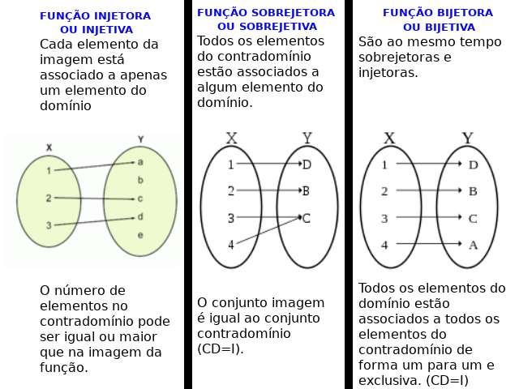

# Funções
2022-04-27
tags: [-Matemática](../-Matemática.md)

Uma variável é quando temos várias respostas para algo, já uma incógnita só possui um valor, na qual ainda não sabemos.

![[Pasted image 20220427002427.png]]


* Domínio = (D) - Todos elementos de A que tem conexão
* Contra Domínio = (CD) Todos os elementos de B
* Imagem = Todos os elementos de B que tem conexão

{ 1, 2, 3 }  
[ 1, 3 ]   
( -infinito, 7]   


Uma função é que todos os elementos do domínio tem uma correspondência num domínio. E essa correspondência para esse Domínio só pode ter uma correspondência em um contra domínio


## Esboçando gráficos


## Estudo de sinais

O estudo de sinais nada mais é que entender como a função se comporta, como cada parte de seu gráfico está localizado. Do mesmo modo podemos entender a junção de duas imagens, ou seja, o comportamento de duas funções, dessa forma, temos dois conjuntos que se unem para se tornarem apenas um conjunto, ou seja, o resultado de duas funções se entrepondo. Para sabermos qual será o resultado dos sinais das funções, precisamos usar o método de estudo de sinais, que consiste na operação de sinais das duas imagens das funções:


-----------------------------------------------


## Tipos de função

**Sobregetora** = A -> B, B = Imagem

**Injetora** = x1 != x2 => f(x1) != f(x2). É Interessante dizer que podemos **observar se temos dois y no mesmo gráfico**, ela só será injetora se não tivermos o mesmo y

Se f é os dois, estamos falando de uma função bigetora. Toda função bijetora admite uma função inversa, geralmente denotada por f^-1, isso é uma notação.




### Funções pares e ímpares

Par:
> f(-x) = f(x) -> f é par

O que significa dizer que (a, b) Pertence ao gráfico de f, assim como (-a, b) pertence ao gráfico 


Ímpar: -f(x) -> f é ímpar

> -f(x) -> f é ímpar

O que significa que (a, b) Pertence ao gráfico de f, assim como (-a, -b) tambem pertence ao gráfico de f. Os pares tem simetria com a origem


### Função constante

Ela é uma reta no eixo x

### Função Afim

Quando temos um x, ela é uma reta que passa os pontos igualmente igual uma identidade só que ela vai se modificar com coeficientes

Exemplo: f(x) =ax+b

2x-1

| x   | y             |     |
| --- | ------------- | --- |
| 0   | 2(0)-1 = -1   |     |
| 2   | 2.(2)-1 = 3   |     |
| 1/2 | 2.(1/2)-1 = 0 |     |


Portando (0, -1) pertence ao gráfico e (2, 3) tá no gráfico também. Contudo, tem que achar também o ponto de intercessão do gráfico que se define quando igualamos a função a 0

2x-1 = 0
x = 1/2

Então o ponto 1/2 tem que estar no gráfico.

#### 1/x

Quanto maior o numerador,maior a distância do centro
Quanto menor o denominador, mais ele vai se deslocar para a direita, então é o contrário
A função -1/x vai ser ela nos outros blocos do cartesiano
E quanto maior o coeficiente, mais ela vai se deslocar para cima


### Função identidade

f(x) =x
Uma reta que passa pelo eixo x sendo x =0

Bicetriz dos quadrantes ímpares


### Função Quadrática

x²

```functionplot
---
title: Função x²
xLabel: 
yLabel: 
bounds: [-10,10,-10,10]
disableZoom: true
grid: true
---
f(x) = x^2
```

Tem várias propriedades bem legais da função quadrática, mas vamos começar com o simples...

**Baskara** = x= −b+-√Δ /2.a → ∆ = b²-4.a.c
**Vertice** = (-b/2a), (-∆/4a)

Esboçando o gráfico (o primeiro exemplo): 


```functionplot
---
title: Função x² +2
xLabel: 
yLabel: 
bounds: [-10,10,-10,10]
disableZoom: true
grid: true
---
f(x) = x^2 +2
```

```functionplot
---
title: Função x²-2
xLabel: 
yLabel: 
bounds: [-10,10,-10,10]
disableZoom: true
grid: true
---
f(x) = x^2-2
```

```functionplot
---
title: Função x²/2
xLabel: 
yLabel: 
bounds: [-10,10,-10,10]
disableZoom: true
grid: true
---
f(x) = x^2/2
```

```functionplot
---
title: Função x² / -2
xLabel: 
yLabel: 
bounds: [-10,10,-10,10]
disableZoom: true
grid: true
---
f(x) = x^2 / -2
```

```functionplot
---
title: Função 2x²
xLabel: 
yLabel: 
bounds: [-10,10,-10,10]
disableZoom: true
grid: true
---
f(x) = 2x^2
```


```functionplot
---
title: Função -2x²
xLabel: 
yLabel: 
bounds: [-10,10,-10,10]
disableZoom: true
grid: true
---
f(x) = -2x^2
```


### Função Modular

Para entendermos função modular, precisamos entender o que é uma função com mais de uma sentença:

$$
f(x) = \begin{Bmatrix}
1, x < 0  \\
2, x > 0 
\end{Bmatrix}
$$

Temos aqui uma função com mais de um comportamento, quando x < 0,  a função assume 1, ao contrário, 2


Dessa forma, temos aqui uma função que se comporta de duas formas. Entenderemos aqui também que o módulo de um número é a distância até o 0 de um número:| |-7| = 7; |6| = 6

Então entenda a definição de uma função modular:
$$
f(x) = \begin{Bmatrix}
|x| = x, x >= 0 \\
|x| = -x, x < 0
\end{Bmatrix}
$$

Desse modo podemos obter `f(x) = |x|`

O interessante das funções modulares é que elas tem uma parada bem decisiva, entende? Quando fazemos |x|, podemos entender que não há uma continuação:


Note que não há nada em y negativo e que a imagem de quando o x é negativo é diferente, criando esse V.

Perfeito, entenderemos então agora a mesma coisa só que com uma função que não é simplesmente |x|, teremos: |x - 1|:


E assim podemos fazer qualquer função modular... Olha também que interessante:

```functionplot
---
title: Função x -1
xLabel: 
yLabel: 
bounds: [-10,10,-10,10]
disableZoom: true
grid: true
---
f(x) = x -1
```

É como se todos os valores que são negativos de f(x) = x -1 fossem refletidos para y positivo, o que torna a função um V

Agora vejamos a seguinte função: f(x) = |x -1| + 2. Não podemos analisar do mesmo jeito, veja:


Quanto maior o termo independente, mais afastada a função estará do gráfico, sendo o termo independente da função citada o +2. Pois +2 só afeta y, ou seja, só afeta a imagem.

|x+2| <=> -(x+2) = -x -2 

Agora, vamos ver um outro caso, quando temos uma ou mais módulos, entenderemos um módulo como uma função, como vimos na definição de módulo, dessa forma, precisaremos tratar cada parte com módulo de uma função como uma função independente fazendo estudo dos sinais, vejamos **f(x) = |x + 2| + | x -1 |**


### Função Composta

É uma função que recebe o resultado de outra função. Uma função que faz o x se associar ao y


g ο f = g(f(x))

#### Exercises


### Funções inversas

Toda função bijetora, tem uma função inversa.


#### Gráfico da função inversa


Segue-se a seguinte definição: 

$$
f(a)= b ⇔ f^{-1}(b) = a
$$
$$
(a, b) ∈ G_{f} ⇔ (b,a) ∈ G_{-f}
$$
Se, em sua função, x = a e y = b → em sua função inversa, x = b e y = a. Desse modo, se (a, b) está no gráfico, (b. a) estará também.

Entendendo que, quando fazemos uma função, levamos x em y, ao fazer a inversa, trazemos y em x. A composta de uma função com a sua inversa sempre será x já que levamos e trazemos de volta.

$$
(f∘f^{-1})(x) = x
$$
$$
(f^{-1}∘f)(x) = x
$$


* Defina o contra domínio para aceitarmos a função ser bijetora
* Defina o gráfico da função
* Definindo pontos do gráfico (a, b), pela definição, (b,a) estará no gráfico também. Poderemos então criar o gráfico
* Defina (composta de f com f^1 ) (x) = x é ache sua inversa

Interessante também que podemos achar f(x) de f ∘ g se tivermos g já que podemos usar a inversa de g para achar f(x)
#### Exercício


### Função Exponencial

> a > 0 a != 1

Função exponencial é quando temos x no ^:

$$f(x) = a^{x} $$

Quando fazemos um gráfico assim, teremos uma função injetora assim:

**Base > 1 = Crescente; Base < 1 = Decrescente**


Detalhes da função exponencial é que ela é crescente, só terá um valor para y, dessa forma. é injetora e como não deram para mim o domínio, será também sobrejetora, dessa forma, será bijetora e admitirá função inversa.


#### Exercises


### Função Logarítmica 

A função logarítmica de base a nada mais é, por definição, do que a função inversa da função exponencial de base a

![[20231108_184036.jpg]]

Então, por definição, sua imagem será o conjunto dos números reais e seu domínio será o conjunto dos números positivos maiores que 0.  
Uma ressalva bem importante é que isso só vale para funções com a > 1

Não existe para a < 1;

Para a entre 0 a 1: 

![[20231108_190444.jpg]]


## Lista de exercícios

[Listas_Fundamentos da Matematica](../../../pdfs/Listas_Fundamentos%20da%20Matematica.pdf)


## Bibliografia

https://plataforma.seliga.com.br/aula/a6e67180-fd06-11ea-8c57-018434849ba6

## Mapa mental

![[Funções Mapa Mental.png]]
