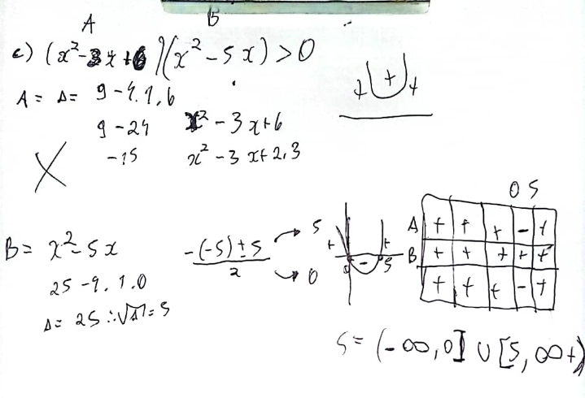

# Inequações
2023-09-20
tags: [-Matemática](../-Matemática.md) [Conjuntos](../Conjuntos%20numéricos/Conjuntos.md) [Funções](../Algebra/Funções.md)

Diferentemente das equações tradicionais que lidam com equabilidades, estamos falando aqui de disparidades, onde não existe apenas uma solução para os problemas, temos um conjunto solução... Podemos tratar as inequações exatamente igual as equações, contudo, temos que ter em mente que o resultado deve ser coerente a inequação e que se multiplicarmos por negativo os dois lados da equação, devemos inverter a relação de ordem:

$$ 2x > 3 → x > \frac{3}{2} → x > 1,5  $$
Dessa forma, podemos concluir que x resolverá a equação quando x for maior que 1,5. Dessa forma, podemos concluir que S  = ( 1,5,  ∞ ), veja [Intervalos](../Conjuntos%20numéricos/Conjuntos.md#Intervalos)

## Inequações de Produto e Inequações de quocientes do primeiro grau

Trate cada relação do produto, ou do quociente como uma função:

Dessa forma, podemos fazer o estudo de sinais das funções: 

## Inequações do 2° grau

Temos que criar um gráfico simplificado com as raízes para fazermos o estudo dos sinais de uma função só: [Inequação 2° grau](../../../img/Inequação%202°%20grau.md)

Da mesma forma que podemos fazer o estudo de sinais de uma função somente, vimos que podemos fazer com somente uma função do segundo grau. Contudo, também podemos aplicar o estudo de sinais de várias funções do 2° grau em produtos e quocientes.
Vale lembrar que quando temos duas equações do segundo grau, podemos fatorar elas e transforma-las em dois produtos notáveis para fazermos um problema com 2 produtos de equações de primeiro grau

### analisando equações com delta negativo

Simples meu bom, se o delta é negativo, nada vai cortar o x, tudo vai ser acima de x, portanto a função tem sinal positivo sempre.

### inequação do 2° grau com produtos

Mas funciona com duas de 2° grau tmbm 

### inequação do 2° grau com quocientes

## Inequações exponenciais

Quando temos uma desigualdade onde as potencias tem bases maiores que 1, o sinal da inequação continua, ao contrário, se inverte.

Vejamos um exercício bem peculiar e junta [Inequações do 2° grau](#Inequações%20do%202°%20grau) com [Inequações exponenciais](#Inequações%20exponenciais): 

## Inequações modulares

|x| = x, se x ≥ 0
-x, se x < 0

Para resolver a inequação, separamos o módulo em dois casos; o primeiro é quando o valor que está dentro do módulo é positivo e o segundo é quando o valor que está dentro do módulo é negativo.

O conjunto de soluções de uma inequação é a união das soluções de cada caso.

$$|x| > 2$$

Quando temos esse tipo de inequação, deveremos dividir em dois casos x e -x

+x: x>2

-x: -x>2 = -x>2 (.-1) = x < -2 

Dessa forma, temos que x pode assumir os valores menores que -2 e maiores que 2.

S = (-∞, -2) U (2, -∞)

Caso não esteja acostumado com esse tipo de formatação:

 S: {x Є R | x < -2 ou x > 2}

## Conclusão

### Inequação do 1° e 2° grau com produto e quociente

Para aquecer a brincadeira  e entendermos de vez tudo, resumir tudo em uma questão só:

## Bibliografia

https://www.youtube.com/watch?v=L1faiCgZxAw

https://youtu.be/mdVzgffO7MY?si=sKrnGUhABk6D5hTs