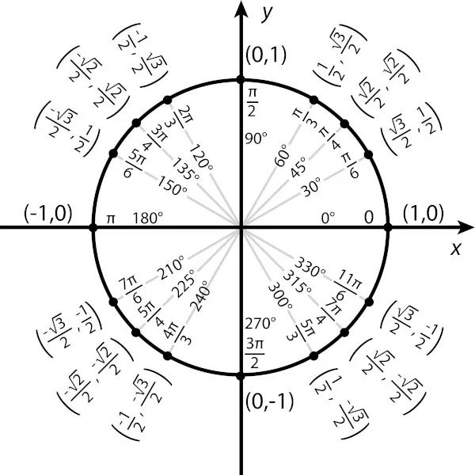
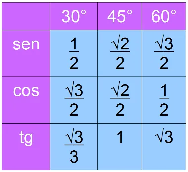

# Trigonometria
2024-09-03
tags: [Geometria](../Geometria.md)

## Desenvolvimento

### Circulo trigonométrico

Visto isso:
$$180° = π rad$$
seja feliz com regra de três simples...

na hora de fazer conversão, pensa em 45 nas divisões pois as mais comuns geralmente vc consegue ir agrupandode 45 em 45 para  dividir, exemplo: 45+45 = 90 e 90 + 90 = 180, então 180 é 4.45, 5.45 = 225... e assim vai.

### Tabela ângulos fundamentais 

F ensino médio que fez noix entender as coisas em graus, 30° = π/6, 45°= π/4 e 60° = π/2

### Identidades trigonométricas fundamentais

$$sin^{2}(θ)+cos^2(θ)=1$$

Para chegar em ângulos estranhos, podemos usar essas fórmulas:

- **Com cossenos:**
    $$cos⁡(A−B)=cos(A)cos(B)+sin(A)sin(B)$$	$$cos⁡(A+B)=cos(A)cos(B)−sin(A)sin(B)$$

- **Com senos:**
    $$sin⁡(A−B)=sin(A)cos(B)−cos(A)sin(B)$$ $$sin⁡(A+B)=sin(A)cos(B)+cos(A)sin(B)$$

Tem que ser cos depois sen, se trocar dá bigode e perceba que para cos é em ordem e em sen é permutado...

-----------------------------------------------
## Bibliografia

~ChatGPT
## Mapa Mental