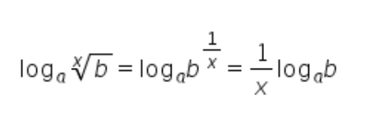
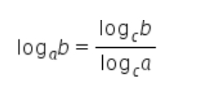
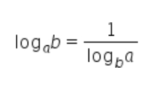
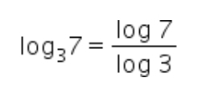

# Logaritmos
2023-12-03
tags: [-Matemática Básica](-Matemática%20Básica.md) [Potências](-Matemática%20Básica.md#Potências)

$$ \log_{2}{32} ⇔ 2^x = 32 $$

Sempre imagina um x depois do 32 e o 2 colocando o lado de lá nas costas (potencia), imagina o movimento que fica fácil de memorizar

## Desenvolvimento

### Propriedades

#### Propriedades operatórias

*  Temos uma propriedade de **multiplicação de logs**

	$$\log _{2} 2.5 = \log_{2} 2 + \log _{2}5 $$

* Temos uma propriedade de **divisão de logs** 
	$$\log_{2}2:4 ⇔ \log_{2} 2 - \log_{2} 4 $$

* Temos uma propriedade de **potência em logs**

	$$\log_{2}2^3 ⇔ 3 . \log_{2}2 $$

* Temos uma propriedade óbvia de **1 de logs**
	Funciona melhor quando abstrai, o log de um número pela base do mesmo número é 1

	$$\log_{2}2 = 1 $$

* Temos uma propriedade que meche com o **0 em logs**
	Qualquer log 1, independente da base, vai ser 0
	$$\log_{139278193792183971}1 = 0 $$

Agora veja uma imagem que abstrai e explica bem isso:


#### Outras Propriedades 

* **Raízes**:

Podemos aplicar essa propriedade no logaritmo de uma raiz, pois, podemos escrever uma raiz na forma de expoente fracionário. Assim:
log com a subscrito espaço x enésima raiz de b igual a log com a subscrito b à potência de 1 sobre x fim do exponencial igual a 1 sobre x log com a subscrito b



Exemplo
Considerando log 3 = 0,48, determine o valor do log 81.

Solução

Podemos escrever o número 81 como sendo 34. Neste caso, vamos aplicar a propriedade do logaritmo de uma potência, ou seja:

log 81 = log 34
log 81 = 4 . log 3
log 81 = 4 . 0,48
log 81 = 1,92

- **Mudança de base**: 


Para aplicar as propriedades anteriores é necessário que todos os logaritmos da expressão estejam na mesma base. Do caso contrário, será necessário transformar todos para uma mesma base.

A mudança de base também é muito útil quando precisamos usar a calculadora para encontrar o valor de um logaritmo que está em uma base diferente de 10 e de e (base neperiana).


A mudança de base é feita aplicando-se a seguinte relação:



log com a subscrito b igual a numerador log com c subscrito b sobre denominador log com c subscrito a fim da fração

Uma aplicação importante dessa propriedade é que o logab é igual ao inverso do logba, ou seja:



log com a subscrito b igual a numerador 1 sobre denominador log com b subscrito a fim da fração

Exemplo
Escreva o log3 7 na base 10.

Solução



Vamos aplicar a relação para mudar o logaritmo para a base 10:

log com 3 subscrito 7 igual a numerador log espaço 7 sobre denominador log espaço 3 fim da fração

#### Propriedades especiais

* Veja essa propriedade: $$a^{\log_{a}c} = c$$
	para melhor entendermos: $$3^{\log_{3}27} =27 $$
	Quando tem a mesma base na base e na base do expoente, o resultado vai ser o logaritmando.


* Logaritmos não podem ser negativos

*  Logaritmo Natural e Exponencial:
	Se 𝑒 é a base do logaritmo natural:
	
	$$𝑒^{ln_{x}}=x$$
	$$ln(𝑒^{x})=x$$
	
	Essas propriedades indicam que o logaritmo natural (base 𝑒) e a função exponencial são funções inversas uma da outra.

### Propriedades avançadas (graduação+)

~Chat GPT

As propriedades que passei cobrem a maior parte dos conceitos fundamentais dos logaritmos. No entanto, existem algumas propriedades adicionais e casos especiais que podem ser úteis em situações específicas. Aqui estão algumas propriedades adicionais dos logaritmos:

#### 10. **Logaritmo de um Logaritmo**

Quando lidamos com logaritmos aninhados (logaritmo de um logaritmo), a manipulação depende das bases e argumentos. Geralmente, isso não leva a uma propriedade direta como as anteriores, mas pode ser útil conhecer:

$$\log_b(\log_c(x))$$

Não há uma simplificação direta sem mais informações sobre \( x \), \( b \), e \( c \), mas essa forma aparece em certos tipos de problemas.

Quando falamos de "logaritmo de um logaritmo", como em \(\log_b(\log_c(x))\), não há uma propriedade universal simples que sempre permita simplificar essa expressão diretamente. No entanto, entender o contexto matemático e possíveis manipulações pode ajudar a lidar com esses casos. Vamos explorar melhor o que você pode fazer com uma expressão do tipo "log de log".

##### Contexto do "Log de Log"

A expressão \(\log_b(\log_c(x))\) pode surgir em diferentes contextos matemáticos, como na análise de complexidade de algoritmos, problemas de crescimento exponencial, modelagem matemática, e em cálculos de entropia em teoria da informação.

##### Manipulações e Usos Possíveis

1. **Mudança de Base**:
   Você pode usar a propriedade de mudança de base para reescrever os logaritmos em uma base comum:
   $$
   \log_b(\log_c(x)) = \log_b\left(\frac{\log_k(x)}{\log_k(c)}\right) = \frac{\log_b(\log_k(x))}{\log_b(\log_k(c))}
   $$

   Isso pode ser útil para converter todos os logaritmos para uma mesma base e simplificar cálculos em algumas situações.

2. **Substituição de Variáveis**:
   Se você estiver resolvendo uma equação, às vezes é útil definir uma nova variável para o "log de log". Por exemplo, deixe \(y = \log_c(x)\). Então, \(\log_b(\log_c(x))\) se torna \(\log_b(y)\). Essa substituição pode simplificar a manipulação e a resolução de equações.

3. **Análise Assintótica**:
   Em muitos contextos, especialmente em ciência da computação, a expressão \(\log(\log(x))\) aparece em análise assintótica (como em funções de complexidade). Aqui, a ideia é entender o comportamento da expressão à medida que \(x\) cresce. Nesse caso, entender que \(\log(\log(x))\) cresce muito mais lentamente do que \(\log(x)\) pode ser o ponto principal.

4. **Expansão em Série**:
   Para valores específicos de \(x\), você pode usar expansões em série de Taylor para aproximar \(\log(\log(x))\). Isso é mais avançado, mas pode ser útil para cálculos numéricos precisos.

A expressão "log de log" não possui uma única simplificação "universal", mas dependendo do contexto matemático, você pode usar propriedades de mudança de base, substituição de variáveis, ou outras técnicas de manipulação para lidar com ela. O importante é entender o objetivo da simplificação ou manipulação e trabalhar dentro desse contexto.

#### 11. **Identidade de Reflexão para Bases Reais (Menos Comum)**

Se \( x > 0 \) e \( x \neq 1 \):
$$\log_x(y) = \frac{1}{\log_y(x)}
$$

Essa propriedade é útil para reescrever logaritmos quando as bases estão "invertidas".

#### 12. **Logaritmos Complexos**

Se você está lidando com números complexos, o logaritmo possui uma forma generalizada que envolve a parte imaginária:

$$\ln(z) = \ln|z| + i \arg(z)$$

onde \( z \) é um número complexo, \( |z| \) é o módulo de \( z \), e \( \arg(z) \) é o argumento de \( z \). Essa forma é usada em análise complexa.

#### 13. **Logaritmo de Produtos Exponenciais**

Para produtos que são exponenciais, pode-se aplicar as propriedades em sequência:

$$\log_b(a^c \cdot d^e) = c \log_b(a) + e \log_b(d)$$


#### 14. **Função Exponencial e Logarítmica como Inversas**

Reafirmando que a função exponencial \( b^x \) e a função logarítmica \( \log_b(x) \) são inversas:

$$b^{\log_b(x)} = x, \quad \text{para } x > 0$$


#### 15. **Logaritmo de Valor Absoluto**

Quando lidando com expressões que podem ser negativas, o logaritmo de um valor absoluto é utilizado:

$$\log_b(|x|) = \log_b(x) \quad \text{(se } x > 0)
$$


Essas propriedades cobrem a grande maioria das manipulações comuns e avançadas com logaritmos. Se você estiver buscando uma propriedade para um caso específico ou mais avançado, posso detalhar mais sobre qualquer um desses tópicos!

#### Exemplos

Agora vamos aos exemplos e tenta faze-los

Sabendo que log_{10} 2 = 0,3 e \log_{10} 3 = 0,47, responda:

1. $$\log_{10}6 = $$
~~~spoiler-block
log_{10}6 = \log_{10}2.3 = \log_{10}2 + \log_{10}3 = 0,3 + 0,47 = 0,77
~~~

2. $$\log_{10}9=$$
~~~spoiler-block
log_{10}9 = log_{10}3.3 = log_{10}3 + log_{10}3  = 0,47 + 0,47 = 0,94

ou

log_{10}9 = log_{10}3² = 2.log_{10}3  = 2.0,47 = 0,94
~~~

3. $$log_{10}\frac{2}{3} = $$
~~~spoiler-block
log_{10}2/3 = log_{10}2 - log_{10}3 = 0,3 - 0,47 = -0,17
~~~

4. $$log_{10}1,5 = $$
~~~spoiler-block
log_{10}1,5 = log_{10}3/2 = log_{10}3 - log_{10}2 = 0,47 - 0,3 = 0,17
~~~

5. $$log_{10}\sqrt{ 2 }$$
~~~spoiler-block
log_{10}√2 = log_{10}√2 = 2^1/2 = 1/2 . log_{10}2 = 1/2 . 0,3 = 0,15
~~~


Entendendo as propriedades básicas, podemos nos aprofundar nas propriedades mais especiais


### log_{10} x -> o queridinho

Quando temos um logaritmo na base 10, não precisaremos colocar a base: 
$$\log 10$$

### ln

e~= 2,71
ln 2 = log_e 2

### Exercícios

tenha certeza de aprender toda a parte de potenciação para fazer esse exercício:

$$\log{_\sqrt{ 8 }}{\sqrt{ 128 }}$$

```spoiler-block

fique na próxima linha e depois faça: alt + seta para baixo. Ao conferir a resposta, fique na linha que tem código da imagem, exatamente como a linha de baixo e faça alt + seta para cima

```


Se:
$$ log_{2}b - log_{2}a = 5$$

Determine quanto vale a/b

```spoiler-block
fique na próxima linha e depois faça: alt + seta para baixo. Ao conferir a resposta, fique na linha que tem código da imagem, exatamente como a linha de baixo e faça alt + seta para cima

```


```spoiler-block
fique na próxima linha e depois faça: alt + seta para baixo. Ao conferir a resposta, fique na linha que tem código da imagem, exatamente como a linha de baixo e faça alt + seta para cima

```


-----------------------------------------------
## Bibliografia

https://plataforma.seliga.com.br/aula/31c17ba0-fd07-11ea-ad80-b7dfb945e303
