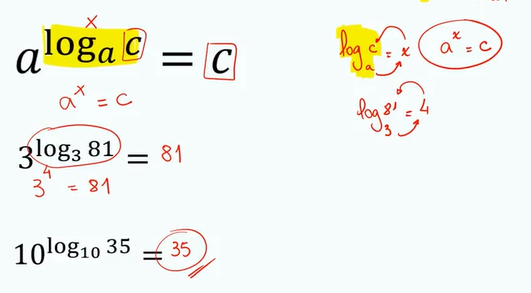
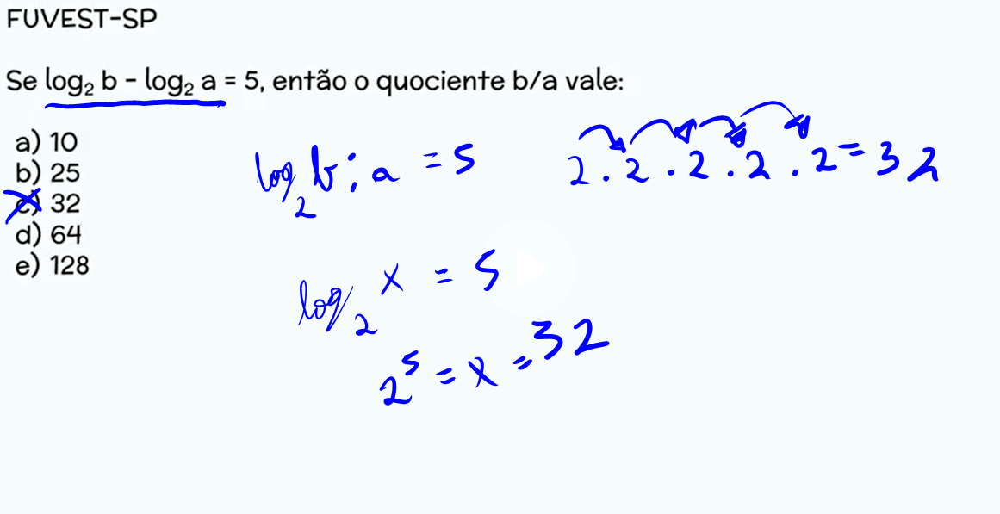
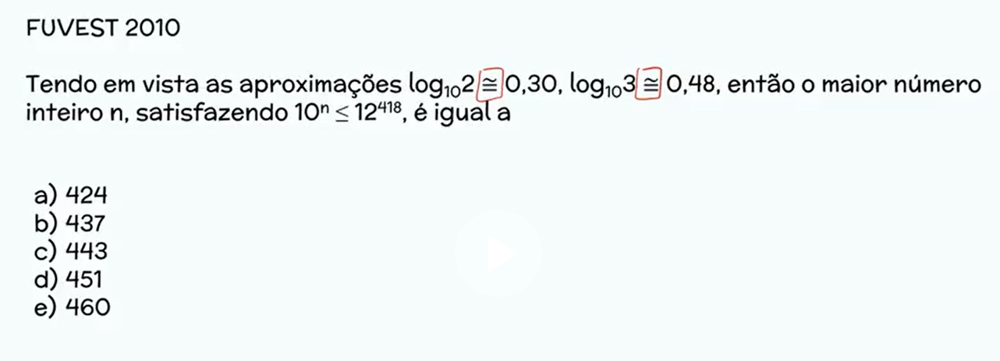
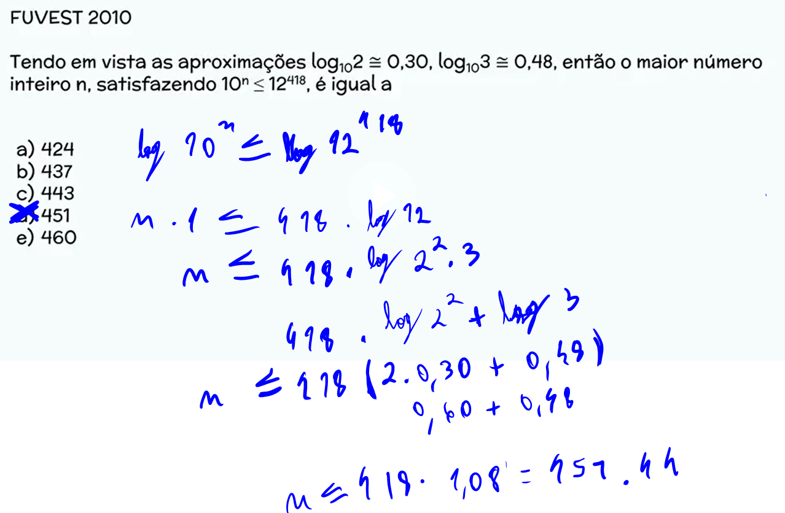

# Logaritmos
2023-12-03
tags: [-Matemática Básica](-Matemática%20Básica.md) [Potências](-Matemática%20Básica.md#Potências)

$$ \log_{2}{32} ⇔ 2^x = 32 $$

## Desenvolvimento

### Propriedades

para nos 

*  Temos uma propriedade de **multiplicação de logs**

	$$\log _{2} 2.5 = \log_{2} 2 + \log _{2}5 $$

* Temos uma propriedade de **divisão de logs** 
	$$\log_{2}2:4 ⇔ \log_{2} 2 - \log_{2} 4 $$

* Temos uma propriedade de **potência em logs**

	$$\log_{2}2^3 ⇔ 3 . \log_{2}2 $$

* Temos uma propriedade óbvia de **1 de logs**
	Funciona melhor quando abstrai, o log de um número pela base do mesmo número é 1

	$$\log_{2}2 = 1 $$

* Temos uma propriedade que meche com o **0 em logs**
	Qualquer log 1, independente da base, vai ser 0
	$$\log_{139278193792183971}1 = 0 $$

Agora veja uma imagem que abstrai e explica bem isso:


#### Exemplos

Agora vamos aos exemplos e tenta faze-los

Sabendo que log_{10} 2 = 0,3 e \log_{10} 3 = 0,47, responda:

1. $$\log_{10}6 = $$
~~~spoiler-block
log_{10}6 = \log_{10}2.3 = \log_{10}2 + \log_{10}3 = 0,3 + 0,47 = 0,77
~~~

2. $$\log_{10}9=$$
~~~spoiler-block
log_{10}9 = log_{10}3.3 = log_{10}3 + log_{10}3  = 0,47 + 0,47 = 0,94

ou

log_{10}9 = log_{10}3² = 2.log_{10}3  = 2.0,47 = 0,94
~~~

3. $$log_{10}\frac{2}{3} = $$
~~~spoiler-block
log_{10}2/3 = log_{10}2 - log_{10}3 = 0,3 - 0,47 = -0,17
~~~

4. $$log_{10}1,5 = $$
~~~spoiler-block
log_{10}1,5 = log_{10}3/2 = log_{10}3 - log_{10}2 = 0,47 - 0,3 = 0,17
~~~

5. $$log_{10}\sqrt{ 2 }$$
~~~spoiler-block
log_{10}√2 = log_{10}√2 = 2^1/2 = 1/2 . log_{10}2 = 1/2 . 0,3 = 0,15
~~~


Entendendo as propriedades básicas, podemos nos aprofundar nas propriedades mais especiais

#### Propriedades especiais

* Veja essa propriedade: $$a^{\log_{a}c} = c$$
	para melhor entendermos: $$3^{\log_{3}27} =27 $$
	Quando tem a mesma base na base e na base do expoente, o resultado vai ser o logaritmando.



* Logaritmos não podem ser negativos


### log_{10} x -> o queridinho

Quando temos um logaritmo na base 10, não precisaremos colocar a base: 
$$\log 10$$


### Exercícios

tenha certeza de aprender toda a parte de potenciação para fazer esse exercício:

$$\log{_\sqrt{ 8 }}{\sqrt{ 128 }}$$

```spoiler-block

fique na próxima linha e depois faça: alt + seta para baixo. Ao conferir a resposta, fique na linha que tem código da imagem, exatamente como a linha de baixo e faça alt + seta para cima

```


Se:
$$ log_{2}b - log_{2}a = 5$$

Determine quanto vale a/b

```spoiler-block
fique na próxima linha e depois faça: alt + seta para baixo. Ao conferir a resposta, fique na linha que tem código da imagem, exatamente como a linha de baixo e faça alt + seta para cima

```





```spoiler-block
fique na próxima linha e depois faça: alt + seta para baixo. Ao conferir a resposta, fique na linha que tem código da imagem, exatamente como a linha de baixo e faça alt + seta para cima

```


-----------------------------------------------
## Bibliografia

https://plataforma.seliga.com.br/aula/31c17ba0-fd07-11ea-ad80-b7dfb945e303
