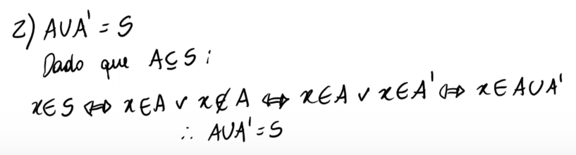
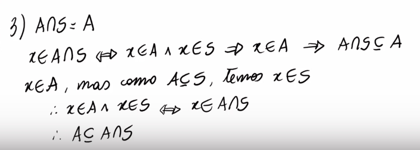
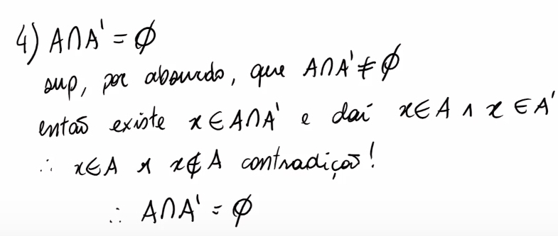
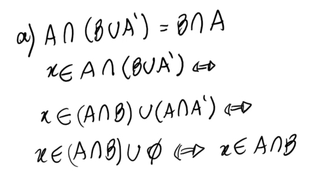
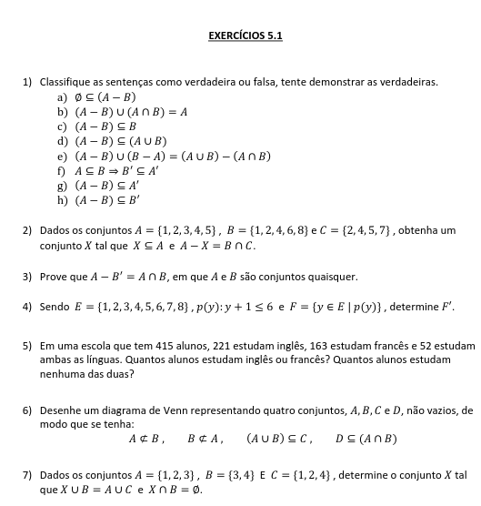
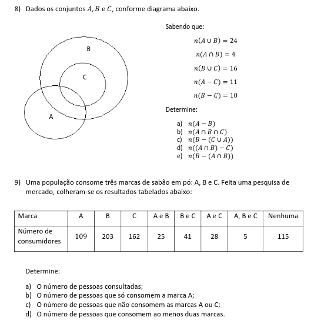
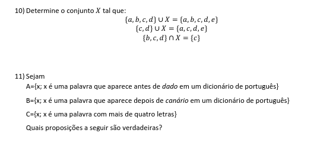
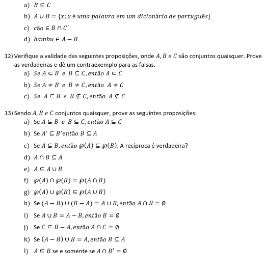

# Conjuntos em Matemática Discreta
2023-10-18
tags: [-Matemática discreta](-Matemática%20discreta.md) [Conjuntos](../Conjuntos%20numéricos/Conjuntos.md)
<div style="display:flex; justify-content: center; text-align: center"> ∪ ∩ ∈ ∉ ⊂ ⊆ ⊄ ⊈ ⊊ ⊃ ⊇ ⊋ ⊅ ⊉ ∅</div>
<div style="display:flex; justify-content: center; text-align: center"> ⋀ ⊻ ⋁ ¬ ⇒ ⇔ </div>


* **Conjuntos** = família não ordenada de objetos → { 3, 2 } === { 2, 3 }
	* ( **{ 3, 4, {4} } != { 3, 4, 4 }**  ) != { 3, 4 }; o quatro em chaves é um conjunto, não um elemento
	* ( ∅ === {  } ) != { ∅ }; Um conjunto com vazio é um **conjunto unitário**
* **Par ordenado** = Família de objetos ordenados → (3, 2) != (2, 3)

* **Pertencimento** **∈ ∉** =
	*  4 ∉ { 3, 2, {4} }; {4} ∈ { 3, 2, {4} }

* **Contém** **⊂** **⊆** **⊄ ⊈ ⊊**  **⊃** **⊇** **⊋** **⊅ ⊉**  =
	* **⊂** **⊆** = ⊂ (Contém mas não pode ser igual) e ⊆ (Contém e pode ser igual), a partir daí pode deduzir os outros.
	* Relação de Contingência=
		A = { 1, 2, 3, 4, 5, 6 }; B = { 5, 6 }:  B ⊂ A (B é um subconjunto de A)  
		A= { 1, 2, 3, 4, 5, 6 }; B = { 1, 2, 3, 4, 5, 6 }: A = B ou A ⊆ B. Mas digamos que não soubéssemos que  B é ó A, poderíamos falar que B é um subconjunto ou o próprio A
		


## Desenvolvimento

### Conjunto partes ℙ(x)
Nota: É o simbolo de números primos, mas não tem um unicode para o conjunto de partes.


Seria esse p da imagem o ℙ que estamos denotando...
ℙ(X) sempre Será todos os x de X, lembre-se do vazio e suas combinações... sempre será 2^n sendo n os elementos...

### Definições - Provando respostas

* **União** (*∪*) = Quando x pertence a A ou a B   
* **Intercessão** (*∩*)  = Quando x pertence a A e a B  
* **Complemento** de A ( 'A ) = Tudo que não está em A  
* **A-B** = Tudo que está em A e não está em B  

* Quando é uma igualdade, geralmente, podemos ir na ida e na volta

#### Por pertencimento


Perceba que sempre assumimos um x pertencente ao conjunto que queremos provar. A união de dois conjuntos para um x nada mais é que um agrupamento, então ou ele está em um conjunto ou em outro, **graças a definição de união**, podemos definir isso logicamente... **x ∈ A ⋁ x ∈ ∅**... E x pertencer a nada é uma **[Contradição](../../Filosofia/Lógica.md#Contradição) (C)**, portanto sempre será falso e temos então que sempre vai ser x ∈ A...

Dessa forma, Temos que podemos seguir postulando fatos até conseguirmos provar.



Veja só, como provamos que A ∪ A' (Seu complemento), é todo o conjunto universo? Temos que definir um x ∈ S, se A está contido em S, ele só pode estar ou não estar em A, que é obviamente seu complemento, então ele pertence a A ou está em seu complemento, dessa forma, x deve estar na união entre A e seu complemento, o que é todo o S.

Então partimos do pressuposto de um x em S e conseguimos chegar a premissa. O que torna a premissa verdadeira.

--- Dúvida ---



Primeiro entende a premissa.
De acordo com a definição de intercessão:  Intercessão(*∩*)  = Quando x pertence a A e a B
Se A está dentro de S, E a ∪ é tudo que está em A e em S, a ∪ será o próprio A... Agora vamos provar isso, é bem mais fácil se sairmos do pressuposto que temos um x ∈ A∩S, se ele está em A, todos os x que estão em A devem estar em S, 

--- Dúvida ---

#### Por Absurdo




Agora, vamos tentar provar que A intercessão seu complemento é vazio, tentar provar que tem algo em algo que não tem nada, é complicado, então tentaremos provar por absurdo, Digamos que não é e vamos tentar achar uma contradição





## Exercícios

Descreve os conjuntos:


``` spoiler-block
a = { 6, 7, 8, 9... }
b = { 3, 4, 5 }
```


```spoiler-block
A = { 5, 6, 7, 8, 9... }
B = { 10, 12, 16, 20 }
C = { 0, 2, 4, 6, 8, 10, 12... }

a) v
b) f
c) v
d) f
e) { 0, 1, 2, 3... 20 } → F ---- Errado - B É MENOR QUE ESSE CONJUNTO, ELE NÃO ESTÁ CONTIDO
f) f
g) v
h) v
i) f
j) V
k) v ------- Errado - UM ELEMENTO NÃO PODE CONTER EM UM CONJUNTO
l) v

```






