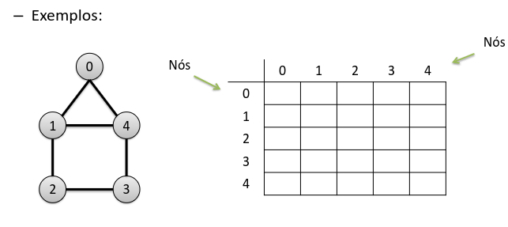
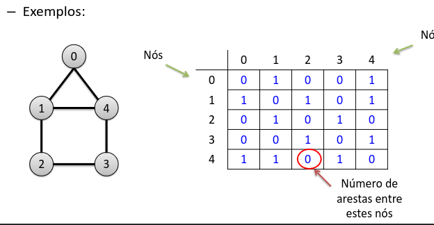
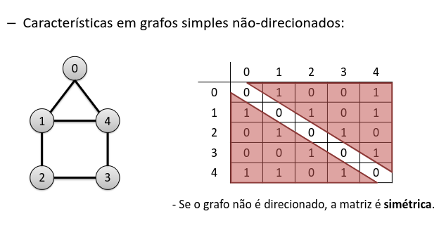
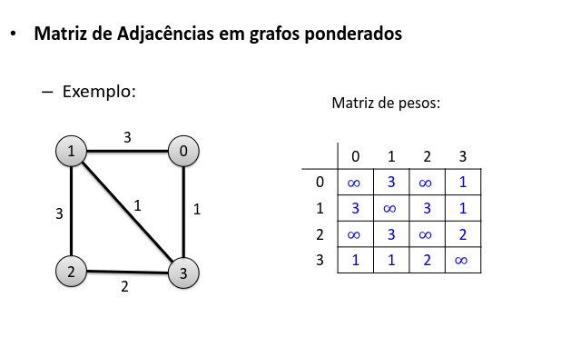
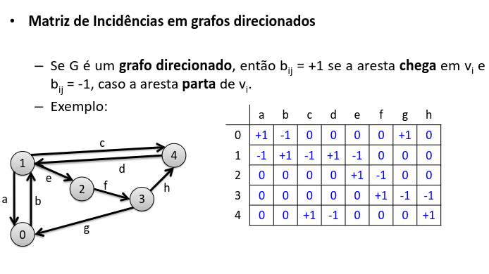
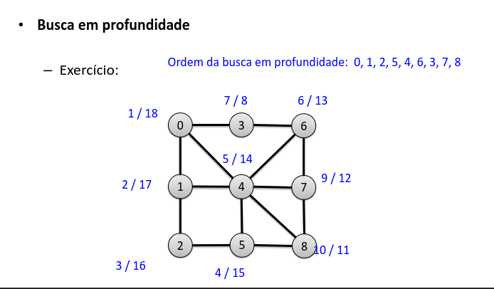
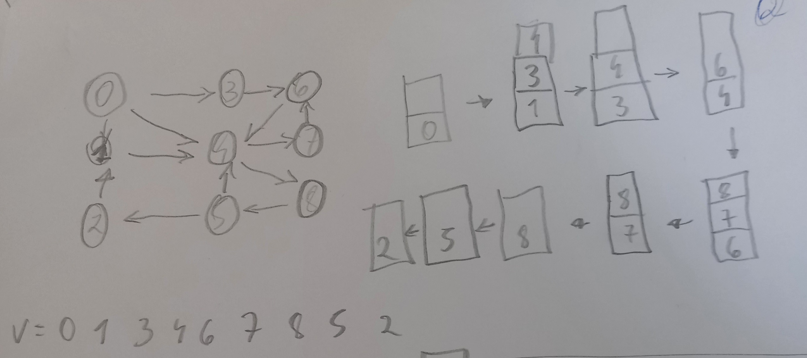
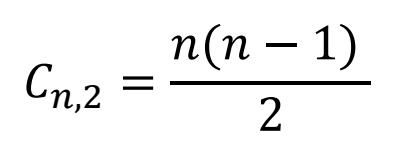
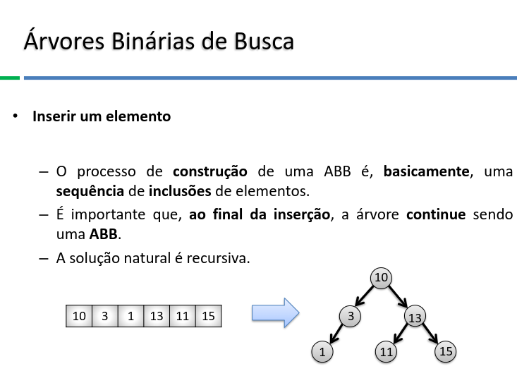

# Algorítimo em Grafos
2025-04-02
tags: [-Software e sua metalinguagem](-Software%20e%20sua%20metalinguagem.md)

* **Convenção**: Sempre que se esgotarem os caminhos laterais, o próximo vértice a ser visitado será o de menor índice.

##  Definições

| Sigla | significado |
| ----- | ----------- |
| G     | Grafo       |
| V     | Vertice     |
| E     | Aresta      |

Nó = Node

Tipos de grafos:
* **Trivial**: Um node apenas
* **Laço**: node que liga nele mesmo
* **Simples**: Sem nós nem arestas nem laços
* **Grafo esparso**: Possuí mais nós espaçados que adjacentes
* **Multigrafo**: Quando existem duas conexões para os mesmos dois nós 
* **Direcionado**: Quando existem direções nas ligações. Quando não tem, ele é **não-direcionado**
* **Ponderado**: Quando temos pesos nas arestas.
* **Cíclico**: Quando um grafo 
* **Regular**: Quando todos os seus nodes possuem o mesmo grau
* **Esparço**: A maioria dos nodes possuem poucas conexões 
* **Conexo**: Quando o grafo não possui ilhas, todos possuem pelo menos uma ligação
* **Completo**: quando todos os nós são ligados diretamente entre eles
* **denso**: muitas arestas em relação aos nós
* **Grafo complemento(Ḡ)**: O grafo com todas as ligações invertidas
* **Subgrafo**: Dizemos que H é subgrafo de G quando H [∈](../Math/Matemática%20Discreta/-Matemática%20discreta.md) G.

Conceitos:
* **deg(g)**: É o grau de um grafo, vêm do inglês degree, significa quantas arestas incidem no node.
* **deg(g) de entrada**: significa quantas arestas entram no node.
* **deg(g) de saída**: significa quantas arestas saem no node.
* **grau médio**: (medium degree) É a média dos graus de um grafo
* **caminho**: sequência de vertices que chegam até determinado node - **Caminhos independentes** são quando não há ligações entre eles
* **comprimento de um caminho**: É o numero de arestas de um caminho
* **Alcançável**: Quando há maneiras de ir de um node para outro
* **Componente conexa** é um subgrafo induzido máximo (ou seja, o maior possível) no qual qualquer par de vértices está conectado por algum caminho.
* **Componentes fortemente conexos** de um grafo direcionado são conjuntos de vértices sob a relação de “mutuamente alcançáveis”.

## Matrizes de adjacência

* Se o grafo não é cíclico, sua diagonal é 0 e é espelhada:

A **soma de uma coluna** é o grau de um nó

**Linhas**:  Cada linha representa um nó de origem.

**Colunas**:  Cada coluna representa um nó de destino.

Em grafos ponderados, temos também a matriz de pesos:

## Matriz de incidência

## Busca em profundidade

* Do nó inicial, vai indo para os próximos nós o mais longe que você conseguir
* Quando não tiver mais onde ir, fecha o nó que não tem mais saída e volta para o último nó. Caso tenha outro caminho, nó nó que voltou, segue por ele o mais longe que conseguir e repete esse passo
* Toda vez que você passar por um nó, coloque ele na pilha de nós passados e marque um passo nele e toda vez que fechar um nó também marque um passo, **nós que já foram passados não marcam passos pois não vão para a lista de nós passados**

## Busca em largura

– Passo-a-passo: 
1. Escolha um vértice inicial v não visitado e o insira em uma fila. 
2. Pegue um elemento da fila, marque como visitado e acrescente seus adjacentes na fila. 
3. Enquanto a fila não está vazia, volte ao passo 2.

Ou seja:

* Defina um node inicial e coloca ele numa fila.
* Toda rodada retire o node na frente da fila e adicione os seus adjacentes a fila
* Toda vez que um node sai da fila, adicione ele a uma pilha de resultado
* Enquanto a fila não está vazia, refaça a partir do passo 2. Quando estiver vazia, refaça a partir do passo 1.

## Ordenação Topológica

• Ordenação topológica – 
Algoritmo: 
* Utilizar a busca em profundidade para percorrer todos os nós! 
1. Primeiro, é escolhido um nó sem dependências. 
2. A partir deste nó, é aplicada a [Busca em profundidade](#Busca%20em%20profundidade). 
3. À medida que cada vértice é terminado, inserir no início de uma lista encadeada. 
4. Se ainda restam nós não visitados, retornar ao passo 1.

## formulinhas

$$V(V−1)$$ 

## Árvores

* Subgrafo gerador: um subgrafo com todos os nós
* Árvores geradoras: um subgrafo gerador conexo e sem cíclico
* Árvore geradora mínima: uma árvore geradora com o menor valor total de pesos

* **Árvore completa**: a distância entre quaisquer nós com um filho nulo é de, no máximo, 1 nível.
* **CHEIA**: Sem nós nulos

* **Propriedade dos ciclos**: Se uma árvore geradora é uma árvore geradora mínima, qualquer aresta que não está na árvore geradora mínima vai ser a maior entre as arestas que com ela fazem um ciclo.
* **Propriedade daa partições**: Se voce fazer uma partição em uma arvore geradora qualquer, a menor aresta que liga as duas partes das partições vai estar em pelo menos uma árvore geradora minima.

* **Isomorfas**:Se mudar a ordem são iguais
	* 

