# - Modelagem de Dados
2024-02-28
tags: [-Software e sua metalinguagem](../-Software%20e%20sua%20metalinguagem.md)

## Desenvolvimento

### Entidades

Uma entidade é um objeto do universo necessidade oferecido pelo cliente.

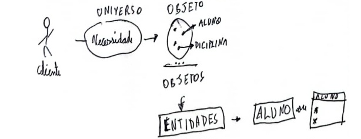

- **Identificado entidades**:    (Não seja muito seletivo, você só não colocará como entidade, o universo)

Um **cliente** vai a uma *concessionária* e é atendido por um **vendedor**. O vendedor, de posse dos dados do **carro** desejado, informa o preço e as condições de pagamento da atual **compra**.

Concessionária = universo.

Um **CD** é composto por várias **músicas**. Uma música foi composta por um ou mais **artistas**. Vários artistas participaram da gravação de uma música. Os artistas são contratados de uma **gravadora**, embora alguns deles possam não ser contratados de gravadora alguma. Um CD é lançado no *mercado* por uma única gravadora, embora alguns deles possam ser independentes (não estao vinculados a nenhuma gravadora).

### Atributos

Informações pertinentes a algo.

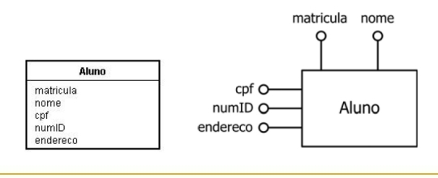

### Relações

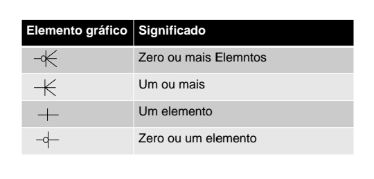

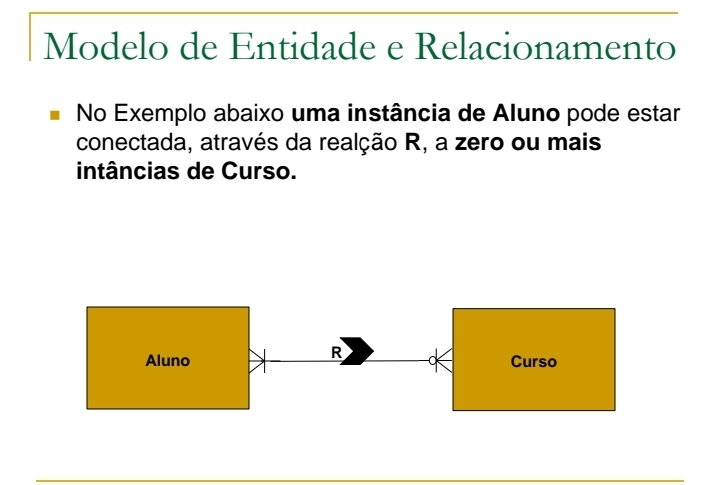

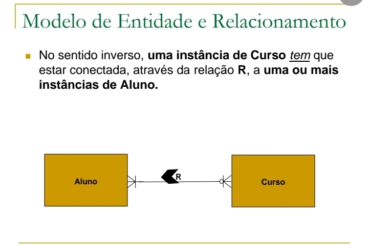

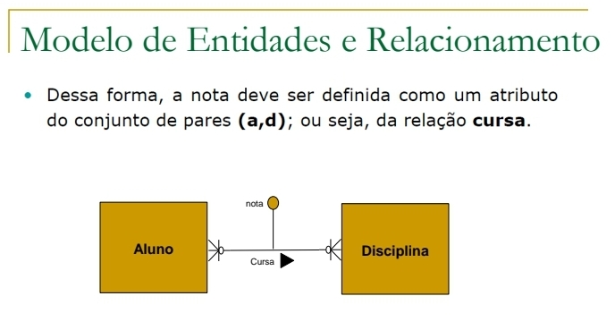

###  Entidade fraca

É uma entidade que as instâncias não podem ser identificadas apenas pelos valores dos seus atributos

Dessa forma, deve-se usar o identificador de alguma outra entidade para formar o identificador 

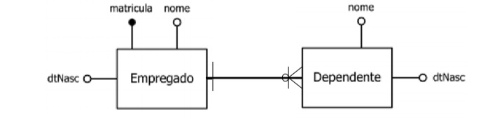

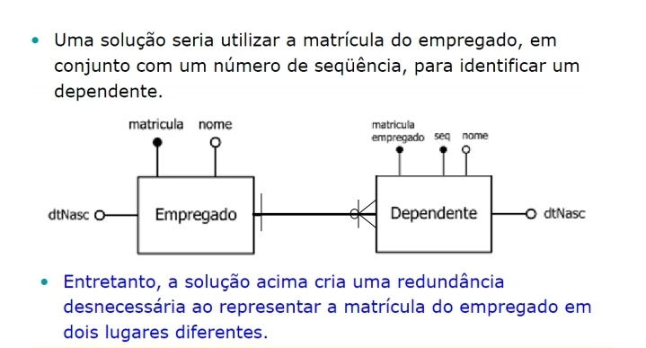

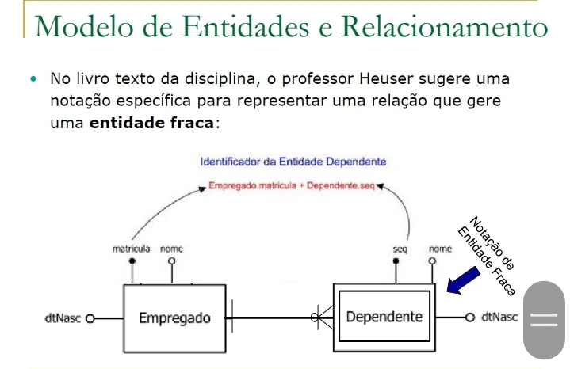

### Generalização

Herança

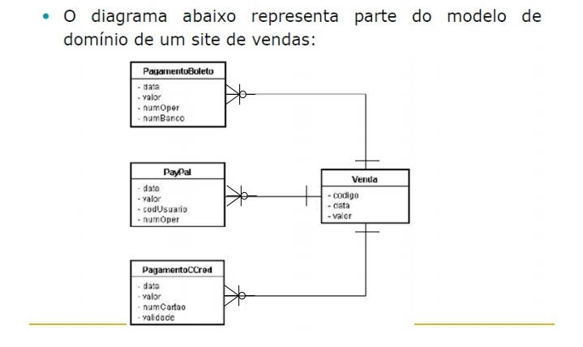

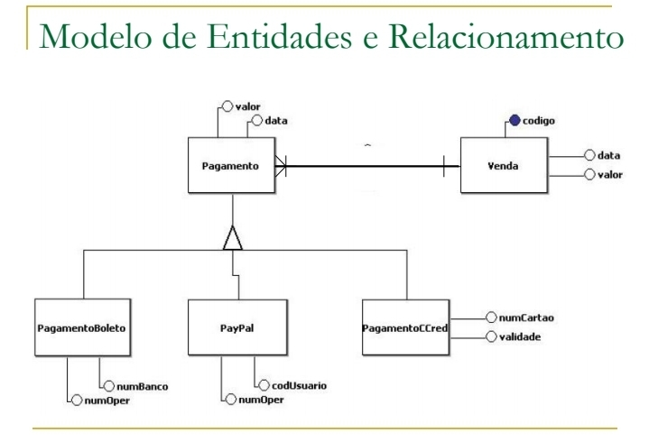

## Exercícios

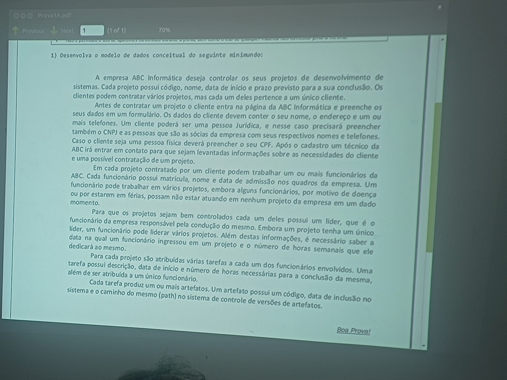

