# Sistemas Operacionais
2025-03-28
tags: [-Software e sua metalinguagem](-Software%20e%20sua%20metalinguagem.md)

## Aula 1

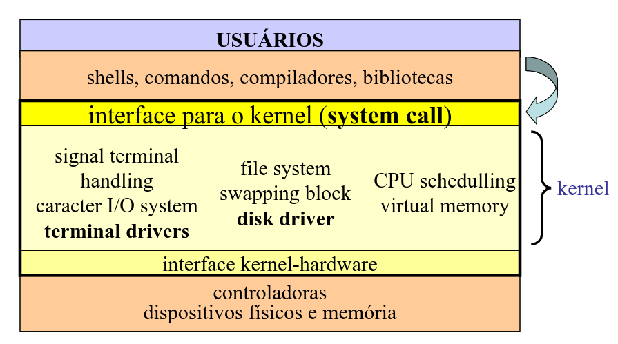

.jpeg)

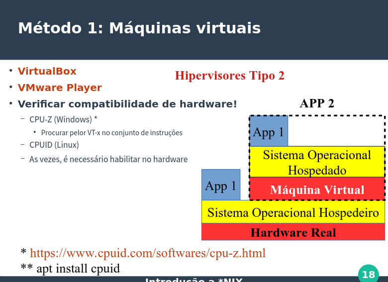

### Comandos Básicos Linux

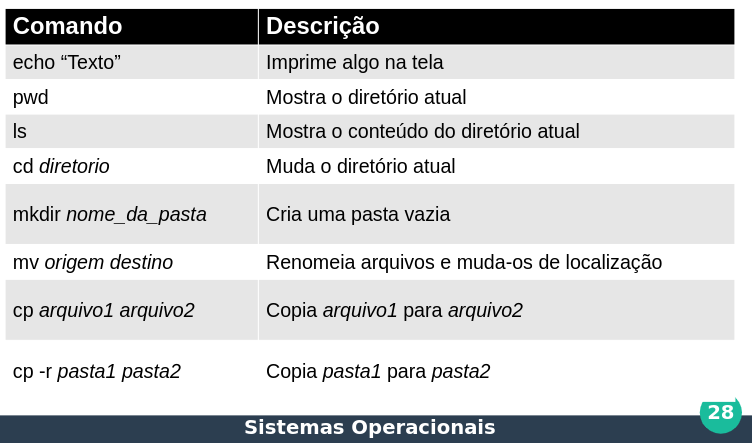

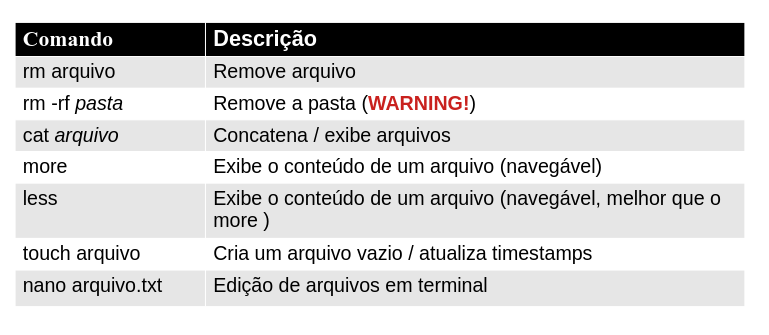

### Caminhos importantes

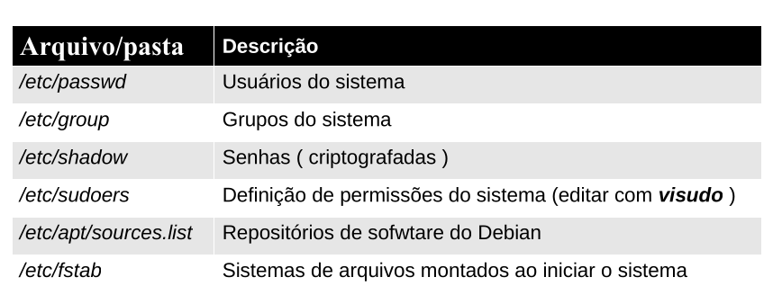

### Redirecionamento


#### comandos de piping

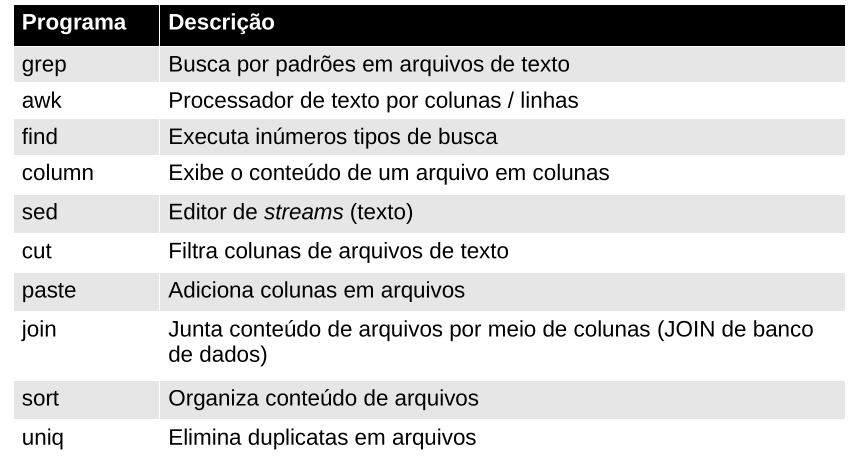


## Aula 2


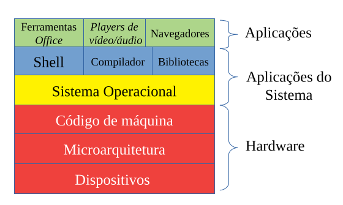

**O que é um SO?**
* É uma máquina estendida
	* Esconde os detalhes daquilo das camadas mais baixas
	* Fornece uma máquina virtual, mais fácil de se usar
* É um gerenciador de recursos
	* Cada programa utiliza um recurso por um tempo
	* Cada programa possui espaço no recurso

### Processos

Um processo é a unidade mínima de abstração do sistema operacional

Processos podem comunicar-se entre si, enviando, ou simplesmente compartilhando dados de outros processos. Dessa forma, existem vários métodos para realizar IPC: Memória compartilhada, mensagens, sockets, RMI, RPC... **E os pipes são a forma de comunicação entre processos**..

Processos possuem 3 segmentos de memória principais:

* **Pilha**: Responsável por armazenar parâmetros, variáveis, e valores de retorno de procedimentos e funções
* **Dados**: Divididas em 2 partes:
	* Estáticos: constantes e variáveis globais do programa
	* Dinâmicas: memória dinâmica ( malloc/free do C )
* **Texto**: Código de máquina do programa

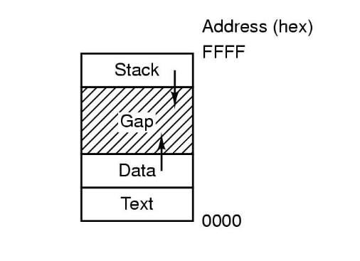

### Blocos

São as menores unidades lógicas de processamento de memória. Imagina o SO lendo o HD, quando vai passando para um buffer os dados, ele vai alocando em blocos esses dados. Hoje, geralmente 4096 Bytes (4 KiB), então se algo tem 10kib ele aloca em 3 blocos de 4kib, ou seja, o tamanho total da alocação dos blocos é de 12kib

#### Definição chat gpt

```md
No contexto de **sistemas operacionais** e **dispositivos de armazenamento**, **blocos** são as **menores unidades de dados** que um sistema de arquivos pode ler ou gravar em um dispositivo de armazenamento, como um HD, SSD, pendrive etc.

### Explicando melhor:

#### 📦 O que é um **bloco**?

- Um **bloco** é uma **porção fixa de dados**, geralmente de **4096 bytes (4 KiB)** hoje em dia.
    
- Ele é a **unidade mínima de alocação**: mesmo que um arquivo tenha só 100 bytes, ele ocupará **1 bloco inteiro** (4 KiB).
    
- Os sistemas operacionais usam blocos para **organizar e acessar os dados armazenados** de maneira eficiente.
    

#### 🗃️ Como os arquivos se relacionam com blocos?

Um arquivo é composto por:

1. **Blocos de dados**: onde o conteúdo real do arquivo é armazenado.
    
2. **Índices (ou ponteiros)**: estruturas que indicam quais blocos pertencem ao arquivo.
    
3. **Metadados**: informações sobre o arquivo, como nome, permissões, data de criação, etc.
    

#### 💡 Exemplo prático:

Suponha um arquivo de 10 KiB:

- Ele será armazenado em **3 blocos** de 4 KiB:
    
    - 2 blocos cheios (8 KiB)
        
    - 1 bloco parcialmente usado (2 KiB usados, 2 KiB "vazios")
        

### Por que usar blocos?

- **Desempenho**: ler dados em blocos é mais rápido do que byte a byte.
    
- **Organização**: facilita a gestão do armazenamento.
    
- **Padronização**: o sistema sabe exatamente quanto buscar ou gravar por vez.
    

Se quiser, posso te mostrar visualmente como blocos, índices e metadados se relacionam num sistema de arquivos como o ext4.
```


### Montagem de arquivos e sistema de arquivos

Veja um sistema de arquivos:

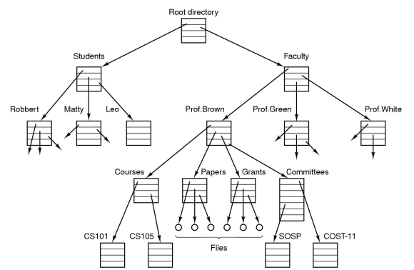

Temos pastas dentro de pastas dentro de pastas que podem ter arquivo ou não, isso é um sistema de arquivos, tal como um explorador de arquivos lê, como seu windows explorer meia boca...

Desse modo, unidades externas ou outros são lidas e montadas nesse sistema de arquivos, no linux, quando você coloca um pendrive, você literalmente monta esse pendrive a uma folha dessa árvore de arquivos.

### Chamadas de Sistemas

Uma **chamada de sistema** (_system call_) é o **meio pelo qual um programa em execução (como um aplicativo) pede um serviço ao sistema operacional**.

Para executar um serviço do sistema operacional, os processos precisam passar do modo de usuário para o modo de kernel.

#### 💻 Alguns exemplos comuns de chamadas de sistema:

Essas são chamadas por de baixo dos panos... Para fazer elas diretamente (*o que não é recomendado pois torna o código usável apenas para o SO do system call usado*) podemos usar em C:

```C
open("documento.txt", O_RDONLY);
```

| Finalidade              | Nome da chamada (Linux) |
| ----------------------- | ----------------------- |
| Abrir um arquivo        | `open()`                |
| Ler dados de um arquivo | `read()`                |
| Escrever no arquivo     | `write()`               |
| Fechar um arquivo       | `close()`               |
| Criar um processo novo  | `fork()`                |
| Esperar outro processo  | `wait()`                |
| Alocar memória          | `mmap()`                |
| Comunicar com hardware  | `ioctl()`               |
Para gerência de processos:

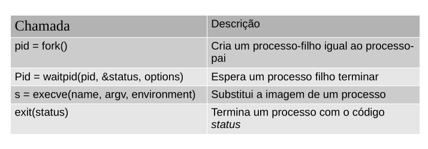

Para gerência de arquivos:

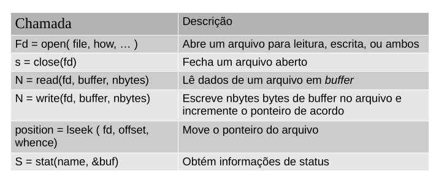

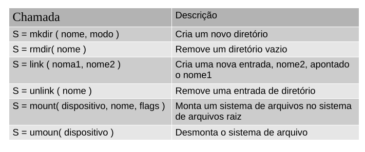

Outros:

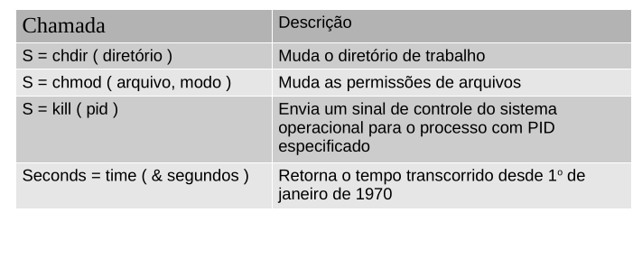

##### Do Windows

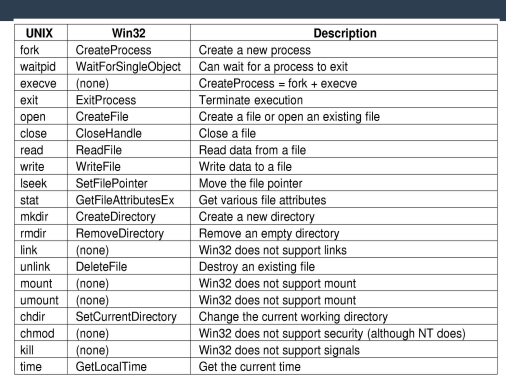

#### Como funcionam

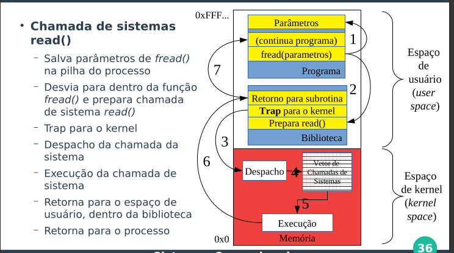


#### Definição chat gpt

```md
Uma **chamada de sistema** (_system call_) é o **meio pelo qual um programa em execução (como um aplicativo) pede um serviço ao sistema operacional**.


##### 🧠 Em termos simples:

> É como o programa dizer: **"Ei, sistema operacional, faça isso pra mim!"**

---

##### 📌 Exemplo prático:

Imagine que um programa quer **abrir um arquivo** no disco. Ele **não pode fazer isso diretamente**, porque **acesso ao disco é controlado pelo sistema operacional** (por questões de segurança e organização).

Então ele faz uma **chamada de sistema** como:

`open("documento.txt", O_RDONLY);`


Essa função `open()` por baixo dos panos **faz uma chamada de sistema** para que o kernel (o núcleo do sistema operacional) abra o arquivo e retorne um identificador para ele.

##### 💻 Alguns exemplos comuns de chamadas de sistema:

| Finalidade              | Nome da chamada (Linux) |
| ----------------------- | ----------------------- |
| Abrir um arquivo        | `open()`                |
| Ler dados de um arquivo | `read()`                |
| Escrever no arquivo     | `write()`               |
| Fechar um arquivo       | `close()`               |
| Criar um processo novo  | `fork()`                |
| Esperar outro processo  | `wait()`                |
| Alocar memória          | `mmap()`                |
| Comunicar com hardware  | `ioctl()`               |

##### 📊 Diferença entre chamada de sistema e função comum:

|Função comum (`printf()`)|Chamada de sistema (`write()`)|
|---|---|
|Executada no espaço do usuário|Executada no espaço do kernel|
|Pode ser otimizada pelo compilador|Controlada pelo sistema operacional|
|Não acessa diretamente recursos do sistema|Tem acesso direto via o kernel|

---

##### 📌 Por que isso importa?

- Chamadas de sistema são **pontes entre o espaço do usuário e o kernel**.
    
- Garantem **segurança**, **controle** e **isolamento** entre programas e recursos críticos (como memória, arquivos, rede, etc).
    
- São fundamentais para qualquer operação real em um sistema.
    

Se quiser, posso te mostrar como ver as chamadas de sistema que um programa faz em tempo real com o comando `strace`.
```


### Kernel monolítico vs Microkernel

O **kernel monolítico** é literalmente um monolito que tem todos os serviços do SO e faz com que tudo rode lá dentro, isso inclui:
- Gerenciamento de arquivos
- Controle de processos
- Drivers de dispositivos
- Chamadas de sistema
- Gerenciamento de memória
Isso faz ele ser **mais rápido**, já que tá tudo junto.

Já o Microkernel, faz **o mínimo possível**: só lida com comunicação entre processos, escalonamento, interrupções. O que **torna ele mais seguro**

| Característica         | Kernel Monolítico    | Microkernel (Cliente-Servidor)      |
| ---------------------- | -------------------- | ----------------------------------- |
| Desempenho             | ✅ Rápido             | ❌ Mais lento (troca de mensagens)   |
| Segurança/Estabilidade | ❌ Baixa (tudo junto) | ✅ Alta (isolamento de serviços)     |
| Estrutura              | Tudo no kernel       | Mínimo no kernel, resto no usermode |
| Exemplo de SO          | Linux, Unix          | Minix, QNX, (parte do macOS)        |
|                        |                      |                                     |


## Aula 3

### Processos e o processador

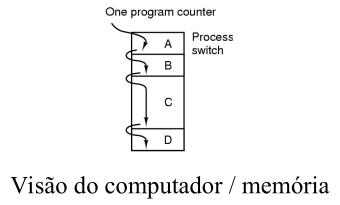

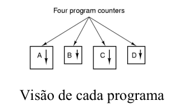

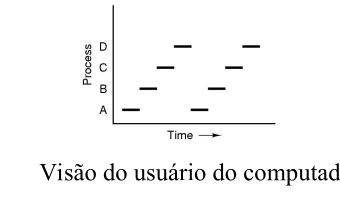


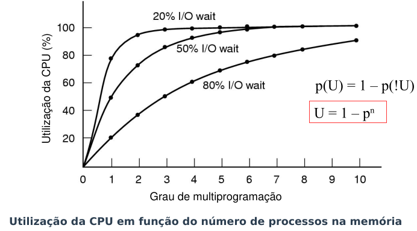

#### Estados de um processo

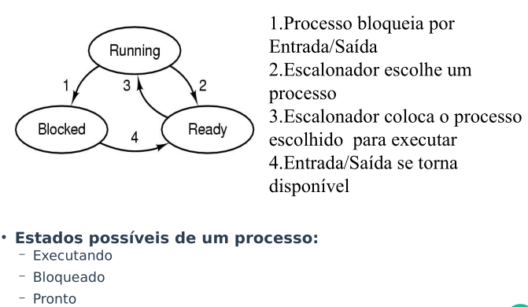


Blocked: Processo executa alguma operação que precisa esperar
Ready: Pronto para ser executado.
Running: Está em execução

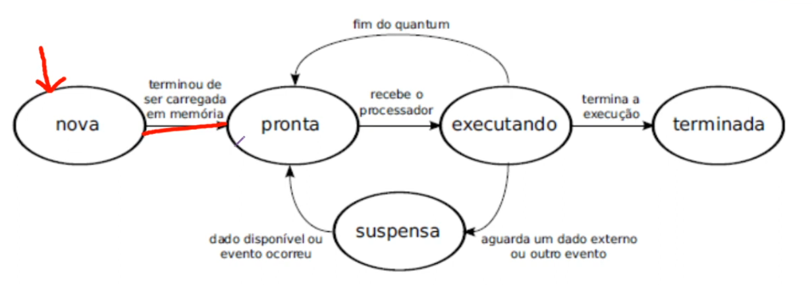

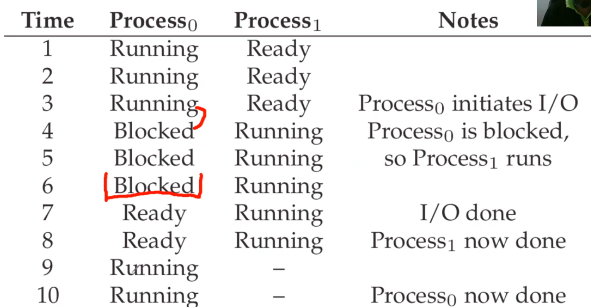

#### Exercise

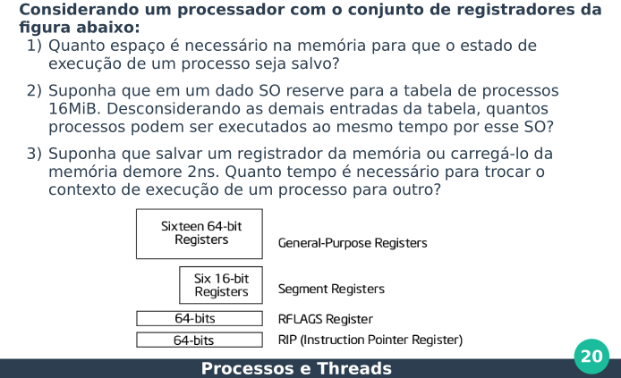


### Threads vs multi threads

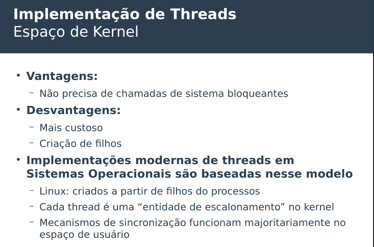

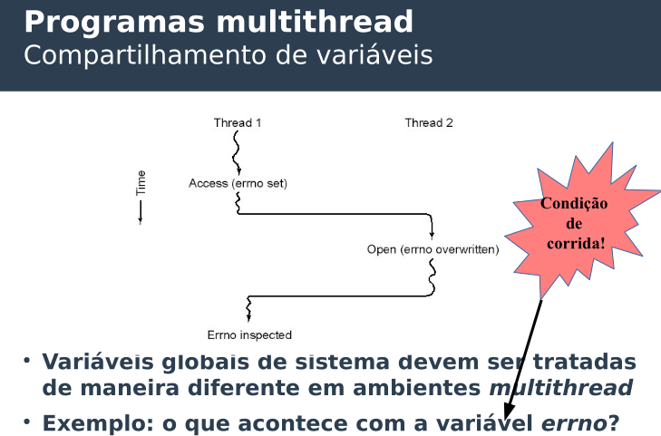


## Aula 4

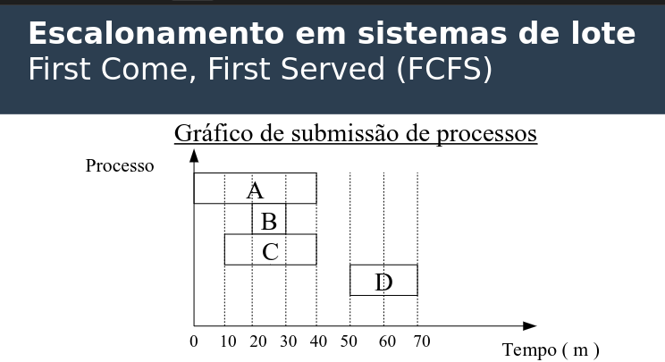

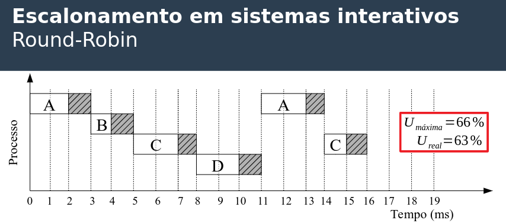

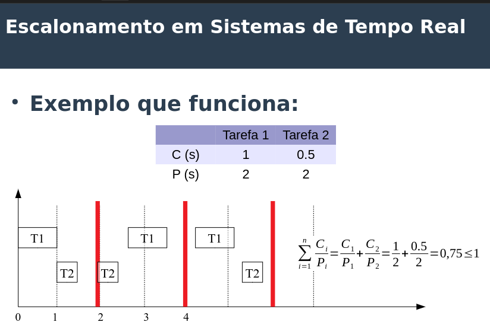


## Aula 5

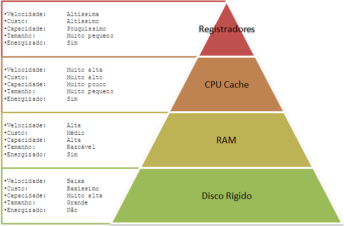


Exemplo 1: Qual é o tamanho total de uma tabela de bitmaps para 128 MiB de memória e tamanho de bloco de 32 B?

$$ 125 Mib = 128 * 2^{20} bytes $$
$$ 32 bytes = 2^{5} $$
$$ \frac{128 * 2^{20} }{2^{5}} = 128 * 2^{15} = 2^{7} * 2^{15} = 2^{22}$$
$$ 2^{22} bytes = 4194304 bytes$$


## Slides


[SO_01-IntroducaoUNIX](../../pdfs/slides/SO/SO_01-IntroducaoUNIX.pdf)

[SO_02-ConceitosSISOP](../../pdfs/slides/SO/SO_02-ConceitosSISOP.pdf)

[SO_03-ProcessosThreads](../../pdfs/slides/SO/SO_03-ProcessosThreads.pdf)

[SO_04-Escalonamento](../../pdfs/slides/SO/SO_04-Escalonamento.pdf)

[SO_05-GerenciaMemoria01](../../pdfs/slides/SO/SO_05-GerenciaMemoria01.pdf)

[SO_06-GerenciaMemoria02](../../pdfs/slides/SO/SO_06-GerenciaMemoria02.pdf)

## Exercícios


[GSI-SO-01_Exercicios_ConceitosProcessosThreads](../../pdfs/exercicios/SO/GSI-SO-01_Exercicios_ConceitosProcessosThreads.pdf)

[GSI-SO-02_Exercicios_Escalonamento](../../pdfs/exercicios/SO/GSI-SO-02_Exercicios_Escalonamento.pdf)

[GSI-SO-03_Exercicios_GerenciaMemoria](../../pdfs/exercicios/SO/GSI-SO-03_Exercicios_GerenciaMemoria.pdf)

[GSI-SO-04_Exercicios_EntradaSaida](../../pdfs/exercicios/SO/GSI-SO-04_Exercicios_EntradaSaida.pdf)


